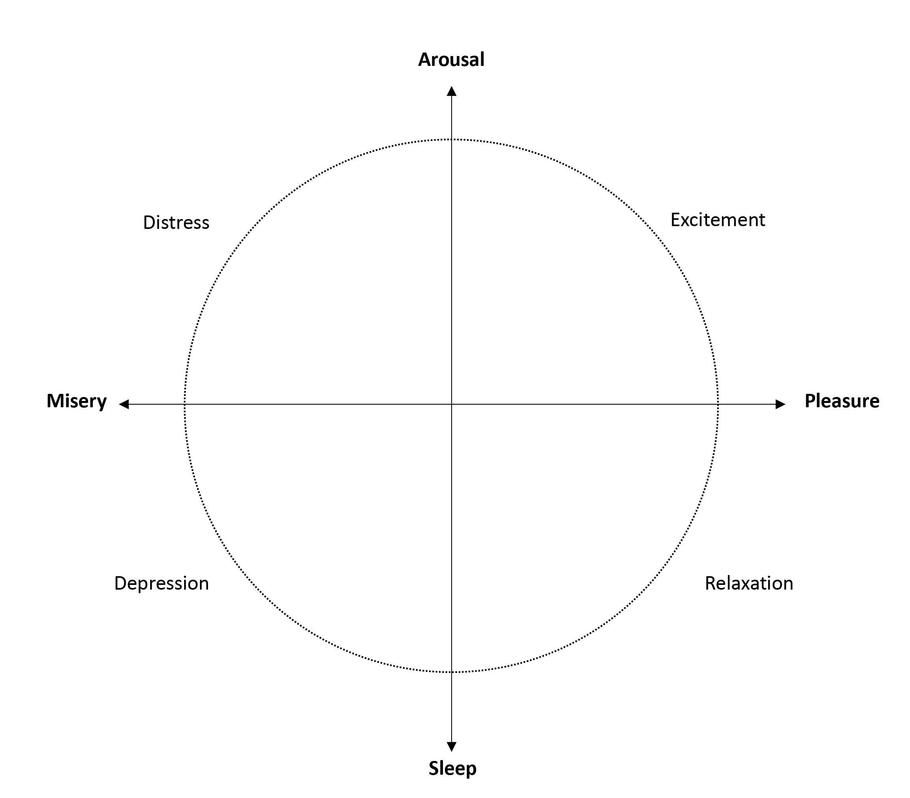

---
output:
  pdf_document: default
  html_document: default
---
# (PART) EMA Outcomes {-}

# Mood {#mood}
\index{Mood}
\index{Mood assessment}

\index{EMA research!Mood disorders}
\index{EMA research!Substance-related disorders}
\index{EMA research!Somatic health}
\index{EMA research!Activity patterns}

Mood is a common outcome in EMA research [@Myin-Germeys2016; @Desmet2016]. Having respondents rate their mood during the day allows researchers to assess mood fluctuation over time or reactivity to events and daily-stressors [@Wenze2010]. Often, it is studied in relation to depressive symptoms and mood disorders [@AanhetRot2012]. In addition, mood can be linked to other variables, such as substance abuse [@Kirchner2013; @Serre2015], somatic health [@Engel2016; @Moore2016] or activity patterns [@Dunton2017; @Marszalek2014].

\index{Mood definitions}
\index{Mood definitions!Mood states}
\index{Mood definitions!Emotions}
The definition of mood varies across studies. Usually the concept refers to a general affective state. Following this line of reasoning, a distinction can be made between mood states (e.g. irritable, cheerful, relaxed, etc.) and discrete emotions (e.g. happy, sad, anxious, etc.), where moods are thought to be less specific and more subjective, enduring and related to context [@Beedie2005; @Cranford2006; @Desmet2016].

Depending on the study focus and research questions, mood measurement can be operationalized in several ways. Therefore, it is vital to consider the goal of measuring mood in your own study and to choose an operationalisation that matches your hypothesis and theoretical framework. In this chapter, we will discuss the most commonly used options: 1) unidimensional mood assessment, 2) the 'bag of items' approach, and 3) dimensional models, namely the Circumplex model and Negative and Positive affect (NA/PA).

## Unidimensional mood assessment
\index{Mood assessment!Unidimensional}
Perhaps the most seemingly straight-forward method to measure mood is to ask 'face-valid' unidimensional questions such as "How is your mood right now" [@VanBallegooijen2016] or "How are you feeling right now" [@VandeVen2017].
Respondents usually rate these questions on a Visual Analogue Scale (VAS), aimed to indicate mood intensity. Typically, VAS scales will range from zero (low or worst mood) to 10 or 100 (good or best mood). Keep in mind that the middle of a VAS scale (e.g. 5 or 50) is generally considered a negative result, and only scores above 6 or 60 are considered acceptable or positive mood states [@Groot2010]. In order to address this issue, some researchers have proposed to use VAS-scales ranging from -1 to 1, with 0 as a neutral centre. However, such a scale implies a mood state that ranges from negative to positive, rather than absent to present. Another alternative is to use Likert scales, where the scale centre often reflects a neutral response.   

Plotting data from an unidimensional item in a graph is an easy way to visually inspect within-subject change in general mood:

```{r fig06a, fig.cap = "34 weeks of mood data, from a single participant"}
# Code snippet 6.1: plotting data over time.
library(ggplot2) 
library(emaph)

plotmood_down <- ggplot(csd, aes(x = date, y = as.numeric(mood_down))) +
  geom_smooth(method = "loess", span = .05, se = FALSE, colour="dodgerblue4") + 
  geom_point(size = .3, alpha = .3, position = position_jitter(height = .1),
  colour="dodgerblue2") +  scale_x_date() + scale_y_continuous(breaks = 1:7) +
  xlab("Time") + ylab("Mood") 
print(plotmood_down)
```  

### Bipolar unidimensional items
\index{Mood assessment!Bipolar unidimensional}
Another option to assist respondents with the interpretation of one-item mood ratings, is to use a bipolar scale. These items place two opposing mood states at each end of the scale, for example by asking "Please rate your current mood on a scale of 0 to 100, on which 0 indicates happy, and 100 indicates sad" [@Vanrijsbergen2014]. This does assume that the opposing mood states, such as happy and sad, are mutually exclusive and thus cannot occur simultaneously.
The bipolar-unidimensional method was shown to be able to predict time to relapse over 5.5 years in recurrently depressed out-patients, with 6.3% of variance in time to relapse explained. This percentage was comparable to that of the HAM-D [@Rijsbergen2012]. Also, the scale was able to detect relapse in patients with recurrent Major Depressive Disorder (based on SCID-I interview) at a cut-off score of 55, and outperformed the HAM-D and IDS-SR. However, 47% of patients indicated by the VAS scale did not fulfil formal criteria for relapse (false positives) [@Vanrijsbergen2014]. 
  
## Bag-of-Items
\index{Mood assessment!Bag-of-Items}
In order to make sure all constructs of interest are measured, you can also consider including a number of specific mood items in your EMA questionnaire, rather than one general unipolar item or one bipolar item. For example you can ask respondents "How depressed are you feeling right now" and "How anxious are you feeling right now [@Starr2012]. This strategy often leads to a 'bag-of-items' approach, where single items from various sources, such as existing questionnaires, are combined into a new EMA questionnaire. A benefit of this approach is that you can select items for which information on validity and test-retest reliability is available. A downside is that item scores can only be evaluated separately, rather that providing one overall indication of mood or well-being.

Combining data from multiple items, such as mood and loneliness, in one graph can provide respondents with insight in the interaction between the constructs. In r two variables can easily be plotted together:

```{r fig69b, fig.cap = "34 weeks of combined mood data, from a single participant"}
# Code snippet 6.2: Plotting multiple variables in one graph.
library(ggplot2) 
library(emaph)

combined <- plotmood_down + 
  geom_point(data=csd, aes(date,as.numeric(mood_lonely)), 
    size = .3, alpha = .3, position = position_jitter(height = .1),
    colour="indianred4") + 
  geom_smooth(data=csd, aes(date,as.numeric(mood_lonely)), 
    method = "loess", span = .05, se = FALSE, colour="indianred2")
print(combined)
```  

## Multi-dimensional mood assessment
\index{Mood assessment!Multi-dimensional}
Dimensional models assume that every affective state or emotion should be described by the combined score on (at least) two items, instead of just one. Over the past decades several multi-dimensional models have been specified (for an overview, see @sander2009). In the context of EMA, researchers most often base their items on the Circumplex model [@russell1980circumplex] or the Negative/Positive affect (NA/PA) theory [@watson1985]. 

### The Circumplex Model
\index{Mood assessment!Circumplex model}
\index{Circumplex model}
\index{Mood assessment!Pick-a-mood scale}

The Circumplex Model of affect [@russell1980circumplex; @Posner2005] argues that all mood states are a linear combination of two independent, bipolar scales: valence (ranging from unpleasant to pleasant) and arousal/activation (ranging from low to high arousal). Combining scores on these scales places the affective states in a circle on one of four quadrants (\@ref(fig:fig06c)). States within one quadrant are believed to be positively correlated, while states in the opposing quadrant are thought to be negatively correlated. 

```{r fig06c, fig.cap = "Russell's Circumplex model of affect.", echo = FALSE, out.width = '60%'}

```

There are several options to operationalise the Circumplex model in EMA research. For example, respondents can rate valence and arousal on two VAS scales. The most pragmatic approach is to report both scale scores separately [@Asselbergs2016]. Alternatively, scores can be combined to give insight into which of the four mood states (quadrants) respondents fall:

- Low aroused - unpleasant
- Low aroused - pleasant
- High aroused - unpleasant
- High aroused - pleasant

A downside of the Circumplex model is that the concepts of valence and arousal can be hard to convey to respondents, especially when translated to other languages, such as Dutch. One alternative is to adjust the scale ends, for example using “extreme sleepiness” and “extreme high energy” [@sharar2016]. 
Another option is to use pictures or emoticons, rather than language. For this purpose, DeSmet and colleagues developed the pick-a-mood scale, which is a pictorial self-report scale [@Desmet2016]. The scale builds on the circumplex model and adds the third dimension "dominance" (level of experienced control over the mood state), rendering eight (instead of four) different mood states and one neutral state (\@ref(fig:fig09d)). 

```{r fig09d, fig.cap = "The Pick-A-Mood Circle.", echo = FALSE, out.width = '50%'}
knitr::include_graphics("images/outcomes/Circumplex-Pick-A-Mood.png")
```

### Negative & Positive Affect
\index{Positive and Negative Affect}
\index{Mood assessment!PA/NA} 
\index{Positive Affect|see{Mood assessment!PA/NA}} 
\index{Positive and Negative Affect!PANAS|see{Mood assessment}}

Watson and Tellegen [@watson1985] also specified the underlying theory of the Circumplex model, arguing that the diagonal quadrants represent Positive and Negative affect (PA/NA) and that these two terms are the main dimensions of affect [@Watson1999]. PA ranges from sadness to high energy, NA from calmness to distress [@Watson1988]. While bipolar-unidimensional assessment assumes that positive and negative affect are mutually exclusive, the PA/NA affect model assumes that these mood states can occur simultaneously. Watson and Clark [@Watson1997] for example, showed a moderate correlation between the two constructs (.32). 
In order to measure Positive and Negative Affect, a designated Positive and Negative Affect Schedule was developed by Watson, Clark and Tellegen [@Watson1988]. Respondents are asked to indicate "to what extent you feel this way right now" on 20 affect items. The scale uses a 5-point Likert-scale, ranging from 1 (very slightly or not at all) to 5 (very) [@Watson1999]. Items include:

- Negative Affect (10): afraid, scared, nervous, jittery, irritable, hostile, guilty, ashamed, upset, distressed 
- Positive Affect (10): active, alert, attentive, determined, enthusiastic, excited, inspired, interested, proud, strong

There are several short-forms available. For example, Wichers and colleagues created a 10-item short-form of the PANAS for their EMA studies. The items were based on the PANAS and their own experience with EMA [@Wichers2012]. Using factor analyses, the following 7-point Likert items were chosen for the questionnaire:

- Negative affect (6): insecure, lonely, anxious, low, guilty, suspicious. 
- Positive affect (4): cheerful, content, energetic, enthusiastic. 

PA and NA were calculated as the average score across all items and weighted for their factor loadings [@Wichers2012].
In r, such a factor analysis can be executed as follows: 

```{r fig06e, fig.cap = "Factor analysis of 7 EMA items, revealing two factors:  Positive Affect (PA) and Negative Affect (NA)."}
# Code snippet 6.3: Performing a factor analysis.
library(dplyr)
library(tibble)

items <- csd %>%
  select(c(
    "mood_enthus", "mood_cheerf",
    "mood_strong", "mood_satisfi",
    "mood_lonely", "mood_anxious",
    "mood_guilty")) %>%
  scale(.) %>%
  as.tibble(.) %>%
  mutate_all(funs(residuals(stats::arima(., order = c(1,0,0)))))

correlations <- cor(items, use = "complete.obs")
fa = psych::fa(items,
               nfactors = 2,
               rotate = "oblimin",
               fm = "pa",
               scores = "regression")

psych::fa.diagram(fa, 
                  simple = TRUE, 
                  main = "")
```
