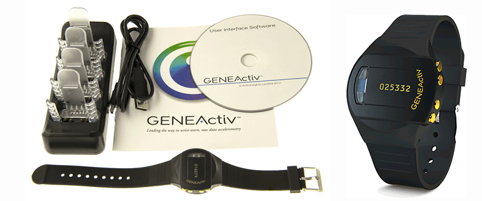

```{r include=FALSE, cache=FALSE}
# # Reproducability --------------------------------------------------------------
# 
# # fix random numbers
# set.seed(1014)
# 
# 
# # knitr chunk options ----------------------------------------------------------
# 
knitr::opts_chunk$set(
  comment = "#>",
  collapse = TRUE,
  cache = FALSE,
  out.width = "98%",
  fig.align = 'center',
  fig.width = 7,
  fig.asp = 0.5,  # was: 0.618 (1 / phi)
  fig.show = "hold",
  message = FALSE,
  warning = FALSE
)
# 
# options(width = 120)
# 
# 
# # standard libraries -----------------------------------------------------------
library(ggplot2)
library(emaph)
# 
# 
# # theming ----------------------------------------------------------------------
# 
# # avoid long pint-out of numeric variables
# #options(digits = 3)
# 
# # avoid long print-outs of tables
# #options(dplyr.print_min = 6, dplyr.print_max = 6)
# 
# # common theme of all ggplot images
# #theme_set(theme_bw(12))
# 
# 
```

# EMA Instruments Catalogue {#ema-instruments-catalogue}

To conduct EMA studies, a variety apps, online applications and wearable devices are on the market. In this chapter, we list a (small) selection of instruments that we found to be in use in scientific studies within the APH consortium.

Table: (\#tab:17a) EMA Instruments.

| Name         | Manufacturer      | URL               | Description
|-------------:|------------------:|------------------:|-------------------------------|
| GENEActive   | activinsights     | activinsights.com | Wrist-worn accelerometer      |
| Illumivu     | Illumivu          | ilumivu.com       | Android / iOS EMA app         |
| MoodBuster   | ICT4D Consortium  | moodbuster.eu     | Android EMA app               |
| Movisense    | MoviSence         | movisense.org     | Android EMA app               |
| PsyMate      | PsyMate           | psymate.eu        | Android EMA app               |
| RoQua        | RoQua             | roqua.nl          | SMS / Browser-based EMA       |
| VU-AMS       | VU                | www.vu-ams.nl     | Wearable for autonomic nervous| 
|              |                   |                   | system measurement            |


## GENEActive
GENEActive, sold by UK-based company Activinsights (activinsights.com), is a waterproof wrist-worn device with a high-precision, configurable 3-axial accelerometer (range: +/- 8g), an ambient light sensor, a (near-body) temperature sensor, and an event logger (a button that users can press to mark a targeted event). GENEActive was developed to accurately assess human activity in scientific studies. The device has a storage capacity of 0.5GB of raw data. At 10Hz, the device can log activity up to one month. July 2018, the price for one unit is approximately 250 euro. 

GENEActive is used in a growing number of clinical studies to measure activity and sleep-wake cycles, in natural conditions, over longer periods of time. Dedicated R-packages to pre-process and analyse the raw data exist (see, e.g., Chapter \@ref(rcat)). Note, however, that no accompanying app exists with which study participants can be provided feedback about their activity. This might negatively affect wear-time and study compliance in research participants, who are accustomed to consumer activity-sampling devices, such as Fitbit, where many options for real-time feedback exist.

```{r geneactive, echo = FALSE, fig.cap = "The GENEActive Accelerometer", out.width='100%', fig.align = 'center', fig.show = 'hold', fig.pos = "!h"}

```

## Illumivu

Ilumivu (see https://ilumivu.com/) is an American commercial company specialized in mobile EMA application development. It offers a cross-platform (Android and IOS) smartphone app (mEMA) that researchers can use to collect data from study participants. Researchers can define the assessment plan of their study in an online backoffice (i.e., without any assistance from Illumivu staff). 

The Ilumivi EMA toolbox library includes a rather complete set of survey elements, survey logic branching tools, and survey scheduling options. Passive EMA options include GPS tagging (of survey responses), GEO-fencing (triggering surveys at specific locations) and smartphone sensor logging (light and noise level, screen brightness, screen locked/unlocked, humidity, ambient temperature, barometric pressure, phone/SMS activity log, and basic device information). a limited number of smartwatch devices can optionally be linked to the Ilumivu app for further passive data collection.  With the online backoffice, researchers can invite participants, monitor study compliance and download data (in common data formats such as CSV). The company is open for custom development, when studies require features that are not included in the default app.

Current (July 2018) subscription plans range from 3.375 dollar (basic features) to 12.000 dollar (all features), per year. Researchers, who are interested in purchasing a licence of the service, are advised to the 'Grant Writer's Guide' of Ilumivu, which can be downloaded from the site of the company (at https://ilumivu.com/pricing/writing-a-grant/).

Ilumivu's competetive advantage is that it has multi-platform support. It is, however, not the cheapest EMA product on the market. Being an American company, researchers should also consider EU regulations relating to personal data privacy protection, since regulations are more strict when personal data of EU citizens leave the EU.  

```{r ilumivu, echo = FALSE, fig.cap = "Ilumivu App Screenshots", out.width = '25%', fig.align = 'center', fig.show = 'hold', fig.pos = "!h"}
knitr::include_graphics(c(
   "images/instruments/ilumivu/iv-app-1.png",
   "images/instruments/ilumivu/iv-app-2.png",
   "images/instruments/ilumivu/iv-app-3.png"))
```

## MoodBuster

MoodBuster (http://www.moodbuster.eu/) is a web-based treatment platform with an integrated (Android) EMA app. The platform was developed by an international non-profit research consortium, including VU, VUmc and GGZ InGeest, in two major EU-funded research projects: ICT4Depression (see ICT4Depression.eu) and E-COMPARED (see http://e-compared.eu).

In the E-COMPARED trial, MoodBuster was used, in five EU-countries, to test blended treatment of major depression [@Kleiboer2016]. In this study, participants used the smartphone app to rate mood and various other depression-related variables, in the context of their treatment, over a period of up to 20 weeks. In addition, the EMA app was used in a satelite study designed to assess the effects of long-term EMA [@VanBallegooijen2016]. MoodBuster will also be used in the EU ImplementAll project (http://www.implementall.eu) and in several other clinical trials that are in preparation.

Currently, EMA assessment protocols are hard-coded in the app. New EMA assessments protocols can be implemented in collaboration with the MoodBuster development team. An online backoffice is in development. While this can be advantage, as researchers ths have more options for custom development, it may take longer before an EMA-study can be started (depending on the specific requirements of the study). Another limitation is that only an Android version of the app is currently available. However, experimental cross-platform versions of the app have been tested in Portugal.

More information on MoodBuster can be requested from Dr. Jiska Aardoom (j.j.aardoom@vu.nl), or prof. dr. Heleen Riper (h.riper@vu.nl).

```{r moodbuster, echo = FALSE, fig.cap = "MoodBuster App Screenshots", out.width='25%', fig.align = 'center', fig.show = 'hold', fig.pos = "!h"}
knitr::include_graphics(c(
   "images/instruments/moodbuster/mb-app-home.png",
   "images/instruments/moodbuster/mb-app-mood.png",
   "images/instruments/moodbuster/mb-app-graph.png"))
```


## Movisens
Movisens (http://www.movisens.com) is a German company that is specialised in the development of hard- and software solutions for mobile sensing. The company sells small wearable devices that contain several high-precision sensors, including an accelerometer, gyroscope, barometer and thermomether. In addition, the company has developed an (Android) app, called MovisensXS, which can be used for active EMA research. The app can optionally be configured for smartphone logging (e.g., to log music that a study participant listens this). The wearable sensor can also be linked to the app, so that EMA questionnaires can be triggered based on targeted activity or energy expenditure patterns, such as extended periods of sedentary behaviour. Specialised software to import, pre-process and analyse raw sensor data is available for download.

Like Ilimuvi, researchers can define EMA sample schedules for their study in a web-based backoffice (https://xs.movisens.com), using an online graphical editor. Once defined, participants can be invited to the study , through the backoffice, to download the freely available Movisens App from Google Play store. The backoffice also allows researchers to monitor study compliance and download data.

MoviSensXS EMA licence costs vary from 500 to 10.000 euro's per year, depending on the required number of 'credits' which are linked to the the number of EMA responses. Prospect users can test platform, without functional restrictions, with a free test account. An EMA test-study can thus be set up and started in less than a day.

A major limitation of Movisens is the lack of an iOS version of the EMA app. Study participants who own an iphone have to be excluded from studies, or will have to be provided with an Android phone. 

```{r movisens, echo = FALSE, fig.cap = "Movisens Sample scheme editor (left) and App Screenshots (right)", out.width = '100%', fig.align = 'center', fig.show = 'hold', fig.pos = "!h"}
knitr::include_graphics(c(
   "images/instruments/movisens/movisens.png"))
```

## PsyMate

The PsyMate™ app (www.psymate.eu) was developed by the Department of Psychiatry and Psychology at Maastricht University in the Netherlands to assess psychological problems in daily life. The app has been validated for use in depression, bipolar disorder, and psychosis, with new scales currently being developed for a range of diseases including Parkinson's disease, pain, cardiology, hypertension, diabetes and Irritable Bowel Syndrome. It is currently used in a EU-funded project to study gene-environment interaction in schizophrenia (http://www.eu-gei.eu/about-the-project/psymate). 

The app is free to download for iOS and Android devices on Apple and Google play stores. Uses for the app include self-monitoring of mood states, for professional support during treatment, or for research purposes. The app can be customized to address specific client needs or research projects with expertise from the Psymate back office, which includes a working group that meets regularly to discuss and advise new projects.

Researchers have access to the raw data without having to go through the Psymate back office. A disadvantage of the Psymate app is that technical problems could arise when there are either iOS or Android updates. Communication from the Psymate back office to researchers about updates and assistance with technical problems could be a point for consideration for using this platform.


```{r psymate, echo=FALSE, fig.cap = "PsyMate App Screenshots", out.width='25%', fig.align = 'center', fig.show = 'hold', fig.pos = "!h"}
knitr::include_graphics(c(
   "images/instruments/psymate/psymate-app1.jpg",
   "images/instruments/psymate/psymate-app3.jpg",
   "images/instruments/psymate/psymate-app4.jpg"))
```


## RoQua

RoQua (http://www.roqua.nl/) is a web-based Routine Outcome Monitoring system, developed and maintained by a Dutch non-profit development and service organization that is funded by several by northern GGZ organisations and the Department of Psychiatry, University Medical Center Groningen. RoQUA has a sophisticated and user-friendly online backoffice portal, with which researchers can define assessment protocols and invite study participants - through e-mail or SMS - to complete questionnaires online (on desktop or mobile devices). By inviting study participants several times a day to complete a questionnaire via the standard web browser of their mobile phone, active EMA an be implemented. This approach is taken in several large-scale studies, including 'NESDA' (nesda.nl) and 'HowNutsAreTheDutch' (www.hoegekis.nl; see [@VanDerKrieke2017; @VanDerKrieke2016]).

At present, RoQua does not support the collection of passive EMA data. However, preliminary results have been reported with a system called 'Physiqual' [@Blaauw2016], with which EMA data, collected with RoQUA, can be automatically combined with wearable sensor data.


```{r roqua, echo = FALSE, fig.cap = "Screenshots of the participant feedback web-page of the 'HowNutsAreTheDutch' project, in which data is collected by the RoQUA system", out.width='30%', fig.align = 'center', fig.show = 'hold', fig.pos = "!h"}
knitr::include_graphics(c(
   "images/instruments/roqua/roqua_p1.jpg",
   "images/instruments/roqua/roqua_p2.jpg",
   "images/instruments/roqua/roqua_p3.jpg"))
```


### VU-AMS

The VU University Ambulatory Monitoring System (VU-AMS; http://www.vu-ams.nl/), developed by the department of Biological Psychology and the Technical Department (ITM) of the Faculty of Psychology and Education, allows ambulant recording of autonomic and cardiovascular activity. VU-AMS measures heart rate, heart rate variability, Respiratory Sinus Arrhythmia, Pre-Ejection Period, Left Ventricular Ejection Time, Respiration Rate, Stroke Volume (SV) and Cardiac Output, Skin Conductance Level (SCL) and Skin Conductance Responses (SCRs) and Tri-Axial Accelerometry (of Body Movement). For the processing of VU-AMS data, a dedicated software suite called the 'Data Analysis and Management Software' (VU-DAMS) is available (for Windows and Mac).


```{r vu-ams, echo = FALSE, fig.cap = "VU-AMS device", out.width = '100%', fig.align = 'center', fig.show = 'hold', fig.pos = "!h"}
knitr::include_graphics(c(
   "images/instruments/VU-AMS/VU_AMS.png"))
```


### Points to consider

-Internet access - whether company has an app or is notification for completion of survey via an email or SMS.
-Use of participants’ own device (fitness device, tablet, smartphone) or designated device – issues of software updates, compatibility issues if using participants device, issues of storage capacity of device if data has to be stored locally (because of lack of internet access) before it can be uploaded to central system.
-Issue of “stigma” of participating in an EMA study e.g. need to explain the carrying/wearing of a device that might not complement participants’ look/lifestyle.
