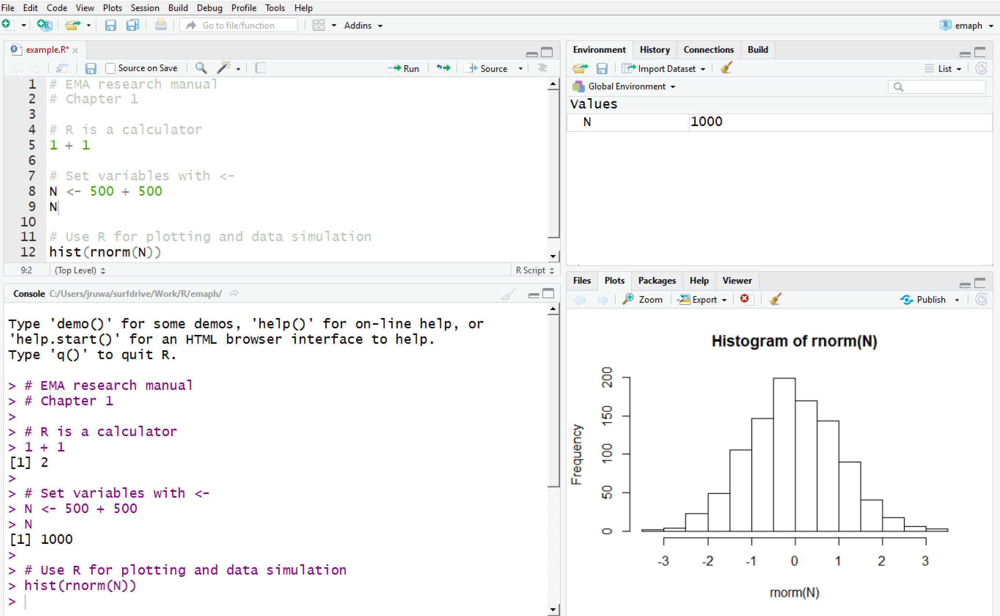
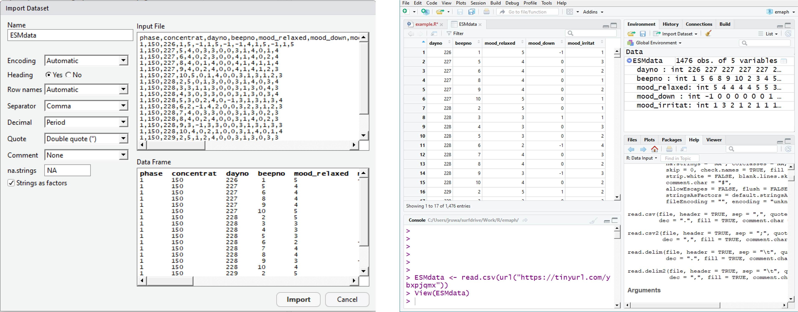

# Introducing R & RStudio {#rstudio}
\index{R and RStudio} 

In this chapter, you will learn how to install and use two programs that are
indispensable for the management and analysis of EMA data: R and RStudio.


## What are R and RStudio?

R is a programming language and software environment for statistical computing
and data visualization. RStudio is a powerful user interface to R. It has many
useful features that greatly simplify R-work. We strongly advise you to adopt
the R/RStudio-combo.


## Why R?

R, you may have been told, is for data scientists, methodologists, and
scientific programmers only. It has a steep learning curve. If you are trained
in SPSS, it will take time to become as productive in R as in SPSS. Why then,
should you invest in R?

  - Unlike SPSS, R is free of charge. It does not eat up your budget. Why pay
    for something that you can get for free?

  - R is cutting-edge. Methodological innovations first appear in R. Network
    analyses, for example, can be run in R, but not (yet) in SPSS. For some
    analyses, you need this alternative.

  - Mastering R improves your connection to the statisticians in your team. They
    probably prefer R over SPSS. It is more efficient and less error-prone to
    all speak the same language.

  - R is great for data-management. Clinical research, and especially EMA
    research, requires hundreds of operations on multiple raw data files. R
    excels at that. SPSS, frankly, does not. If you care about reproducible
    research (which you should), R can be a great help in putting it into
    practice.

  - R can be used at different levels. If you want to be a basic user, that's
    fine. However, if you want to dive deeper, you will find that you can easily
    do so. You can study source code to understand a particular technique
    better. You can code new functions. R allows you to grow.

  - R's user base is expanding every year. Chances are high that R will be the
    standard in your next workplace. R will look great on your CV.

You don't have to be a programmer or methodologist to use R. Yes, it takes time
to unlock its full potential, but you should be able to run basic analyses in it
within a week. This chapter will get you started.

## Installing R & RStudio
\index{R and RStudio!Installing} 

Both R and RStudio are available, at no costs, for all major operating systems.

- Download R from the Comprehensive R Archive Network (CRAN), at 
  https://cran.r-project.org/bin/

- Download RStudio from http://rstudio.org

Install R first, and RStudio second. If you install the programs in this order,
RStudio will automatically find R on your computer.

If you installed R or RStudio previously, please update. This manual assumes you
will be working with version 3.4.2 (or higher) of R, and version 1.1.414 (or
higher) of RStudio.


## Interacting with R through the RStudio Console
\index{R and RStudio!Console} 

If you open RStudio, you will be presented with the interface shown in Figure
\@ref(fig:r-interface). RStudio's main window is divided in four panes (sub-windows), which further contain several tabbed windows.

```{r r-interface, fig.cap="The RStudio Interface", out.width="98%", echo=FALSE}

```

Commands are sent to R in the bottom-left pane, named "Console". To test
this, move your cursor to the bottom line, immediately after the prompt sign
(`>`). Next, type the statement below (note that `#` denotes a comment line; R
ignores it, so there is no immediate need to type that). To execute, press
`Enter`.

R will execute the command and return the answer back to the console.

```{r r-calc, eval = FALSE}
# R is a calculator.
1 + 1
```

Results of calculations can be saved into variables, by making use of the
assignment operator (`<-`). If you type the name of a variable, R returns its
value.

```{r r-assign}
# Use <- to declare and set a variable.
N <- 50 + 50
N
```

To understand why R is such a popular tool for statistical computing, consider
the following command, which, in one line, 1) uses the variable N, just created,
to 2) generate 100 random numbers from the normal distribution, and 3) plot a
histogram of these numbers.

```{r r-hist-norm, eval = FALSE}
# Plot the histogram of a sample from the normal distribution.
hist(rnorm(N))
```

The plot appears in the bottom-right pane, as in Figure \@ref(fig:r-interface). 


## Writing R-scripts
\index{R and RStudio!Scripts} 

Working in the console is a great way to interactively explore R and data, but
what if you want to save a particularly useful chain of statements? For this,
you can use a script file.

To create a script file, use the RStudio menu: `File > New File > R Script`.
This will open a new tab in the top-left pane of RStudio, where you can edit
the script.

  - In the script window, type all statements that you have been entering in the
    console in the previous section.

  - Next, select all lines in the script.

  - Press `Ctrl+Enter` to run the script.

All commands in the script are executed. The commands are echoed in the console
pane, and results are shown immediately, as was the case before, when you typed
the commands in the console yourself.

Scripts can also be run line by line. Move the cursor to the line you want to
run, and press `Ctrl+Enter`. The line is copied to the console and executed, and
the cursor in the script will move to the next line, allowing you to walk
through the script, step by step.


## Importing Your Data
\index{R and RStudio!Data import} 

Something that confuses new RStudio users, who are more familiar with SPSS, is
that it is not obvious how to import data into RStudio. In SPSS, the data
are in plain sight. In R, you first have to import the data.

### Using RStudio Menus to Import Data 

One way to load data into R is to use RStudio's data import wizard. Follow the
steps below to see how this works with data stored in a comma-separated-values
(csv) format, a common data format to which many programs, including SPSS and
Excel, can export data to.
 
- Download the example csv data file at <https://tinyurl.com/yczmjdat> (or create
a csv-version of one of your own data files).

- In RStudio's menu, choose `File > Import Dataset > From Text (base)`.

- In the window that appears, click on `Browse` to locate the csv-
file on your computer, and click `Import` in the next window (see Figure
\@ref(fig:r-import)).

RStudio shows the data, in tabular view, in the top-left window, ready for
analysis. You will also find a new entry in the `Environment`-tab in
the top-right pane. When you click the small arrow, at the left of the name, you
will see a brief summary of the contents of the data.

```{r r-import, fig.cap="RStudio's CSV import wizard.", out.width="98%", echo=FALSE}

```

### Using Functions to Import Data

While RStudio's Data import wizard is useful, you will probably use it less over
time. Most likely, you will convert to using the more efficient R commands to
import data. For example, it takes only a single line to download and import the
example data.

```{r r-read-url}
# Import csv-data, from the internet.
ESMdata <- read.csv(url("https://tinyurl.com/yczmjdat"), row.names = NULL)
```

### Accessing your Data

Since the data is now in the environment (under the name `ESMdata`), you can use
it in other R commands. For example, to produce a more detailed summary of the
first four columns of `ESMdata`, you type:

```{r r-summary, comment = NA}
# Summarize data.
summary(ESMdata)
```

To inspect the first 6 lines of data, type:

```{r r-head, eval = TRUE}
# Show first 6 lines of a data frame.
head(ESMdata)
```

To view all rows of data in a spreadsheet (as in Figure \@ref(fig:r-import)),
type:

```{r r-view, eval = FALSE}
# Show data as spreadsheet.
View(ESMdata)
```

To work with a specific variable in the data set, use `$`, for instance, to print
the first 20 numbers in the `mood_relaxed` variable, type:

```{r r-head-var, eval = FALSE}
# Access a single variable in a data frame.
head(ESMdata$mood_relaxed, n = 20)
```

This allows you to apply functions to specific variables. For example, to
calculate the mean of scores in `mood_relaxed`, type:

```{r r-mean}
# Calculate the mean of a variable.
mean(ESMdata$mood_relaxed)
```

There are many ways in which you can summarize and manipulate your data. At this
point, the important milestone is that you have imported and accessed data in R.


## Extending R with Packages
\index{packages} 

R's attractiveness lies in the ease with which it can be extended with new
functionality. Through so-called packages, which can be freely downloaded from
the internet, specialized functions can be added to your work-space.

### Installing R-packages from CRAN
\index{CRAN}
\index{tidyverse}

Packages can be found at the CRAN website. To browse through the impressive list
of available packages, see
<https://cran.r-project.org/web/packages/available_packages_by_name.html>

If you find a package you like, you can install it via the RStudio menu system,
choosing `Tools > packages`. But you can also use the console, via the
`install.packages` function.

A popular package, `tidyverse`, is used extensively in the examples of this
manual. This package comprises a set of popular packages from the creators
of RStudio, that greatly simplify working with R. So, while you are at it,
install this package now.

```{r r-install, eval = FALSE}
# Install a package from CRAN.
install.packages(tidyverse)
```

The `tidyverse` contains a package called `haven`, which allows you to read and
write SPSS data files (.sav files). This is very convenient. You don't have to
convert all your SPSS data to csv files. See `?read_spss` to learn how to import
an SPSS-file (or use the data import wizard, by choosing `File > Import
Dataset > From SPSS`, in RStudio's top-right pane).


### Installing R-packages from GitHub
\index{GitHub}
\index{emaph}

Not all packages are at CRAN. Many 'unofficial' packages are shared at a site
called 'GitHub'. This book's companion R package `emaph`, for example, which
contains specialized EMA functions data sets, is on GitHub. You need package
emaph to run many examples in the book, so let's install this package now.

GitHub packages can be installed via the `install_github` function, which is
defined in a package called 'devtools'. So, to install `emaph`, enter the
following in the console:

```{r r-install-emaph, eval = FALSE}
# Install the GitHub 'emaph' package.
install.packages("devtools")
devtools::install_github("jruwaard/emaph")
```


### Using Packages
\index{packages} 

To use packages, you have to tell R to load them, each session you want to work with them. You do this with the `library` function. For example, to use package `tidyverse` and `emaph`, type:

```{r cs2l, eval = TRUE}
# Load packages.
library(tidyverse)
library(emaph)
```

Once loaded, you can use the functions and data sets of the packages. Package
`emaph` provides data set `csd`, which contains the data from the 'critical
slowing down'-study [@Kossakowski2017; @Wichers2016], in which a patient
recorded his mood, for 239 days (see also Chapter \@ref(csd)).

To plot the irritation levels of this patient in the first six days, using the
`ggplot` function from package `ggplot2` (which is in `tidyverse`), type:

```{r r-irriplot, eval = TRUE, warning = FALSE, fig.cap = "Irritation levels of a single patient, in the first six days of an EMA study. Missing values were most prominent at day 1, and irritation varied most at day 3.", fig.asp = 0.4}
# Using ggplot to plot EMA time series.
ggplot(data = subset(csd, dayno <= 6),
       mapping =  aes(x = beepno, y = mood_irritat)) + 
  geom_point() +  geom_step() + 
  ylab("Irritation level") + 
  scale_x_continuous(breaks = 1:10) +
  facet_wrap(~ dayno, nrow = 2)
```


## Getting Help
\index{R and RStudio!Help} 

R has no point-and-click menu's that you can browse through to select a
statistical procedure. This is a problem for many new users. What if you want,
for example, to generate random numbers from a distribution with a mean of 2 and
standard deviation of 4? How to tell this to R?

### Using '?' to Consult the Documentation

The good thing is that you already know the name of the function to use, since
we used it in the previous section: it is `rnorm`. To check the documentation of
this function, type `?rnorm` in the console.

```{r r-help, eval = FALSE}
# Use '?' to find the documentation of a function.
?rnorm
```

This opens the documentation of the `rnorm` function in the `Help`-tab, in the
bottom right pane, from which you learn that that the `rnorm` function accepts
`mean` and `sd` (standard deviation) as additional parameters, which are 0 and
1 default, respectively (which explains why `rnorm(100)`
worked in the previous examples). So, to generate the required numbers, you
type:

```{r r-hist, eval = FALSE}
# Plot the histogram of a custom random sample.
hist(rnorm(1000, mean = 2, sd = 4))
```

All functions in R are documented, and this documentation is shown in RStudio's
Help pane when you prepend `?` to the name of the function in the console.


### Using RStudio's Global Documentation Index Search

What if you do not know the name of a function? Suppose you want to run a t-test
for independent groups. Does R have a function for that?

At the top-right of the `Help` pane, RStudio has a search input field, which
allows you to search through all documentation that is installed on your
computer. The search field auto-completes your input. If you type a 't' in this
field, you will be presented with a list of functions starting with a 't'. In
this list, you find a likely candidate: a function called `t.test`. From the
documentation of this function (`?t.test`), you learn that, indeed, this is the
function you were looking for.

```{r r-ttest-sim}
# Run a t-test, on two simulated samples.

# generate two samples (N = 100 per group) from the normal distribution
A <- rnorm(100); B <- rnorm(100)

# the t-test should be non-significant 
t.test(A, B)
```


### Learning from Examples

This book contains many R code snippets. By studying these examples, you will
become more familiar with R.

Some examples will introduce R language constructs and functions that are
unknown to you. Learn from these examples, by using `?` on each element that you
do not understand.


### Google 

With Google, you will find many answers to your R questions. Googling for
"t-test R", for example, results in a rich set of online resources. Good
resources are:

  - RSeek (see <http://rseek.org/>)

  - Stackoverflow: (see <https://stackoverflow.com/questions/tagged/r>)

  - SearchR (see: <http://search.r-project.org/>)


### Read Books

This book does not provide a comprehensive tutorial. There is no need for that,
since excellent resources are readily available. A selection is presented below.

  - Many mental health researchers own a copy of Andy Field's popular book
    "Discovering Statistics Using IBM SPSS Statistics" [@FieldSPSS]. For
    those, Field's R-version of this book, "Discovering Statistics Using R"
    [@FieldR] provides a familiar companion in making the transition to R. See
    <https://www.discoveringstatistics.com/>

  - Free manuals can be found at the official CRAN site. The manuals are dry,
    but complete and authoritative, since the authors are members of the R core
    development team. See <https://cran.r-project.org/manuals.html> (or type
    `help.start()` in the console).

  - While at CRAN, be sure to browse the 'contributed documentation'-section. On
    this page, you will find many freely available manuals contributed by the R
    community. See <https://cran.r-project.org/other-docs.html>


### Online Courses

  - DataCamp, an online data science education platform, offers several
    interactive courses in R. See <http://www.datacamp.com>

  - The Try-R course at the CodeSchool website provides an alternative to
    DataCamp. See: <http://tryr.codeschool.com/>

  - The Quick-R website provides a concise introduction to R. See
    <https://www.statmethods.net/>


### Learn R, in R
\index{swirl}

Package `swirl` contains a set of interactive courses that teach many aspects
of the R language. See <http://swirlstats.com>

```{r r-swirl, eval = FALSE}
# Start the interactive swirl-course.
install.packages("swirl")
library("swirl")
swirl()
```
