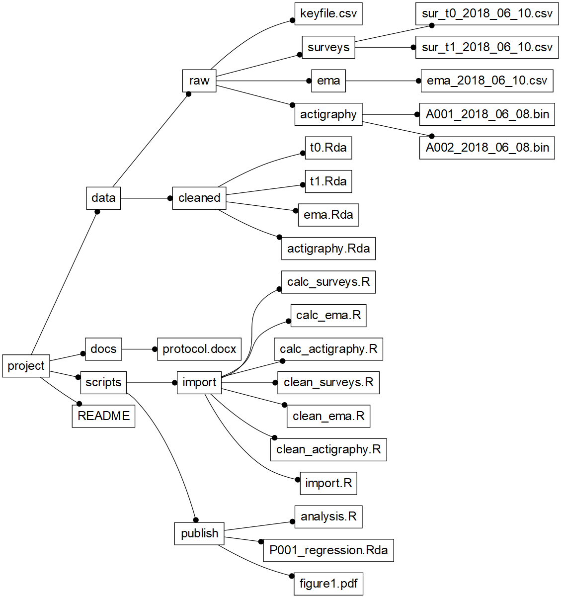

# Data management {#datamanagement}
\index{Datamanagement}

In a typical EMA study, lots of data are collected. Repeated self-reports,
GPS-data, accelerometer data, background demographic data and traditional
questionnaire data quickly add up to gigabytes of raw data. Without proper data
management, the EMA researcher would drown in these data. Fortunately, R and
RStudio are useful aids to prevent this from happening. R is very flexible in
the management of multiple data files, and RStudio includes a handy feature,
called "Projects", with which data and analysis scripts can be stored in an
orderly fashion.

## Using RStudio-projects 
\index{RStudio Projects}

RStudio projects can be opened by double-clicking existing projects, or by
creating new projects from RStudio's file menu. To create a new project, choose
`File > New Project...`. You will be asked to specify the project name and its
disk location (as shown in \@ref(fig:fig5a), after which the project will open in
a new window.

```{r fig5a, echo= FALSE, out.width = "70%", fig.cap =  "creating a project in RStudio"}
knitr::include_graphics("images/datamanagement/new_project.png")
``` 

One of the advantages of using RStudio Projects is that projects set the working
directory to the project directory location. You can verify this by asking R to
print the current working directory, by typing the 'getwd()' function in the
console, while the project is open.

This may look like a trivial feature. It is, however, a great advantage, because
it allows for the use of relative paths, which is very convenient. For example,
to open a data source in a script, you no longer have to specify its full path
(e.g., 'D:/work/projects/my_ema_project/data/raw/ema_data.csv'). With
relative paths, you can simply type 'data/raw/ema_data.csv'. This saves typing,
but, more importantly, it allows you to freely move your projects to other
locations, without breaking the proper functioning of your scripts.

##  An Example Project Directory Structure
\index{Datamanagement!Project directory structure}

RStudio imposes no limitations to the contents of project directories. You are
free to organize the project in the way you want. In clinical research, however,
you are advised to choose a structure that aids you best to implement the
following research guidelines:

  - You should adhere strictly to a clear and logical directory structure, to
    ensure that co-workers and external auditors can quickly grasp and replicate
    your work;
    
  - Raw data should be part of your project, so that results can be traced back
    to their source;
    
  - Cleaned data should be separated from raw data, and data cleaning procedures
    should be explicit and replicable;
    
  - Data and analyses should be clearly separated;
  
  - All analyses should be explicit and replicable;
  
  - Output of (published) analyses should be saved.

A directory structure based on these guidelines is listed in Figure
\@ref(fig:fig5b). It depicts the organization of a project in which data were
collected via:
\index{QuestManager}
\index{Movisens}
\index{GENEActive}

1.  an online survey system (QuestManager), to assess demographics and pre/post
    study depression severity (with the PHQ-9 questionnaire, @Kroenke2009),
    
2.  an active EMA smartphone app (Movisens - see Chapter
    \@ref(ema-instruments-catalogue)), to assess day-to-day changes in mood, and
    
3.  an accelerometer (GENEActive - see Chapter \@ref(ema-instruments-catalogue))
    to assess activity levels.

```{r fig5b, echo = FALSE, fig.cap="Example project directory structure", out.width = "85%"}
# Figure 5.2: Show the EMA R-project directory structure.

library(DiagrammeR)
library(data.tree)

path <- c(
    "project/data/raw/keyfile.csv",
    "project/data/raw/questmanager/qm_baseline_2018_05_01.csv", 
    "project/data/raw/questmanager/qm_posttest_2018_05_01.csv", 
    "project/data/raw/movisens/ms_export_2018_05_01.csv", 
    "project/data/raw/geneactive/ga_APC009_2018_04_26.bin", 
    "project/data/raw/geneactive/ga_APC009_b_2018_05_01.bin", 
    "project/data/raw/geneactive/ga_APC010_2018_05_01.bin",
    "project/data/raw/geneactive/ga_APC011_2018_05_01.bin", 
    "project/data/cleaned/demographics.Rda", 
    "project/data/cleaned/depression.Rda", 
    "project/data/cleaned/mood.Rda",
    "project/data/cleaned/activity.Rda",
    "project/scripts/import/import_questmanager.R", 
    "project/scripts/import/import_movisens.R", 
    "project/scripts/import/import_geneactive.R", 
    "project/scripts/import/explore.R",
    "project/scripts/publish/analysis.R",
    "project/scripts/publish/P001_regression.Rda",
    "project/scripts/publish/figure1.pdf",
    "project/README.txt"
)

x <- lapply(strsplit(path, "/"), function(z) as.data.frame(t(z)))
suppressWarnings(x <- dplyr::bind_rows(x))

x$pathString <- apply(x, 1, function(x) paste(trimws(na.omit(x)), 
                                              collapse = "/"))
mytree <- data.tree::as.Node(x)

data.tree::SetGraphStyle(mytree, rankdir = "LR", width = 800, height = 2000)
data.tree::SetNodeStyle(mytree, 
                        fixedsize = FALSE,
                        fontname = 'arial', 
                        fontsize = 20,
                        arrowhead = "dot",
                        shape = "box")
data.tree::SetEdgeStyle(mytree, arrowhead = "dot", penwidth = 1)

export_graph(ToDiagrammeRGraph(mytree), "images/datamanagement/project_tree.png")


``` 


## Data
\index{Datamanagement!raw data}

Full replicability implies that raw data can be traced back to the source.
Wherever possible, this should translate to the availability of raw study data
in your project.

In the example project, unprocessed data files exported from the three data
collection systems (i.e., QuestManager, Movisens and GeneaActive) are stored in
the 'data/raw"-directory', in separate sub-directories per system.

In 'data/raw/questmanager', we find two files: 1)
'qm_baseline_2018_05_01.csv', containing the results of demographic
questionnaire and the PHQ-9 pre-test, and 2) and
'qm_posttest_2018_05_01.csv', containing the results of the PHQ-9 post-test.
In exports of such survey systems, data from all participants are typically
stored in one file per assessment moment. Note how the export date is added to
the files, to make sure that future updates are only used in the analysis when
explicitly noted. 

In 'data/raw/movisens', we find one file: 'ms_mood_2018_05_01.csv',
containing the results of the EMA mood measurements of all participants,
exported from the back-office of the MoviSens application.

Finally, in 'data/raw/geneactive', we see a series of '.bin' files: binary data
files that were exported from the GENEActive smart watches that were worn by the
participants. Actigraphy data are high-volume: these files are typically large
(500MB is no exception). By using the '.bin' format, in which data are compressed,
disk space is saved (in uncompressed format, data in a single .bin file can
amount up to 2 Gb). Unlike the survey and EMA mood data, each data file in this
directory contains data of one participant. In this case, there are even two
files for one participant ('APC009'), perhaps because this participant started the
study with a faulty device, which was swapped during the study.

In 'data/raw', a final very important file is 'key_file.csv'. This file is
important because it ties all the data together. It contains the unique
identifiers (IDs) that are assigned to the study participants in the various data
collection systems. Ideally, of course, participants would be designated by a
single ID in each data collection system. In practice, unfortunately, this is
often not possible due to limitations of the systems used. As a result,
researchers are forced to deal with the fact that participants are known under
different IDs in each system. With a key-file, data can be tied together
through scripts.

In the example key-file below, we find four columns. The first column defines
the global study ID for each participant (i.e., the ID that the researcher
intends to use as the "official" ID). The other three columns define how the
participant is identified in each of the data collection systems.

Table: (\#tab:tab5a) Example Study Key-file

|  ID        | QM_ID    | MoviSens_ID    | GeneActive_ID  |
|:-----------|:---------|:---------------|:---------------|
| P001       |  QM01221 | 192.A102.83A   | APC009         |
| P002       |  QM01228 | 192.B106.73X   | APC010         |
| P003       |  QM01230 | 192.B220.00N   | APC011         |


## Import scripts

In 'scripts/import', we find the scripts with which the raw data are imported
and cleaned, to produce ready-to-analyze data that is stored in 'data/cleaned'.

By making these scripts parts of your project, you ensure that you and others
can always trace the decisions that were made to prepare the raw data for
analysis. Raw data may be updated, for instance because more participants are
recruited, or because new data exports are made from the data collection
systems. You may also detect errors in the import routines during the analyses,
or peer reviewers may request information that can only be found by going back
to the raw data. In all these cases, the availability of ready-to-run raw data
import routines is crucial.

The code snippet below illustrates the kind of data transformations that you can
expect to find in an import script. With a few lines of code, raw baseline
questionnaire data are imported into R, participant id's that are specific to
the data collection system are replaced by the proper global study id, variables
of interest are selected, sum scores of the PHQ-9 are calculated, data ranges
are checked (and corrected if needed), and data types are set (in accordance to
the study code-book). Finally, the cleaned data set is saved to the
'data/cleaned' folder, ready for further processing in the final analyses.

```{r cs5a, eval = FALSE}
# Data import example

# import raw questmanager baseline data (csv file)
d <- read.csv("data/raw/questmanager/qm_baseline_2018_05_01.csv")

# inject study ID, from study key file
keys <- read.csv("data/raw/keyfile.csv")
d <- merge(d, keys)

# only keep variables of interest 
d <- d[c("ID", "gender", "age", paste0("phq", 1:9)]

# calculate PHQ-9 sum score
d$phq <- rowSums(d[paste0("phq", 1:9)])

# replace out-of-range data with missing values (NA)
d$age[d$age > 100] <- NA
d$age[d$age < 5] <- NA

# turn gender into a proper factor
d$gender <- factor(d$gender, levels = c("M", "F"))

# save cleaned baseline data to data/cleaned, in R (.Rda) format
baseline <- d
save(baseline, file = "baseline.Rda")
```

The code snippet above illustrates the importance of code documentation. You may
struggle to immediately understand some of the code segments. For instance, you
might not be familiar with the `paste0()` function that is used to create the
names of the variables that contain the PHQ-9 item scores. Fortunately, however,
it becomes clear that the code statement calculates the sum of the item from the
comment just above the code (the line starting with `#`). Use these comments in
your code. You will do yourself and your colleagues a big favor by making it
much easier to quickly grasp the meaning of your code.

## Reproducible Analyses

When raw data stored, imported and cleaned, final analyses can be run. By basing
these analyses on the cleaned data in 'data/cleaned', you ensure that these
analyses can be fully reproduced from the raw study data.

The code snippet below illustrates a typical analysis file: cleaned data are
loaded into the R work environment, after which EMA scores of a single
participant are selected, plotted and analyzed in a simple linear regression.
Both the plot and the result of the regression are saved in the analysis
directory. The plot is saved as a PDF-file (ready for submission to the
journal), and the regression results are saved in a standard R data structure.

```{r cs5b, eval = FALSE}
# Data analysis example

# import cleaned EMA mood study data
load("data/cleaned/mood.Rda")

# create and save Figure 1: EMA mood data, of participant P001 
d <- subset(mood, ID == "P001")
pdf(file = "scripts/publised/figure1.pdf")
plot(mood ~ time, d)
dev.off()

# run a regression model on P001 mood data
fm <- lm(mood ~ time, d)
summary(fm)

# save regression results 
save(fm, file = "scripts/published/P001_regression.Rda")
``` 

R's ability to save the results of analyses to disk is yet another example of
how R promotes accountability in clinical research. Suppose you used the
regression analysis of 'P001' in a manuscript that you submitted for publication.
Reviewers ask you to send residual plots, to convince them that the residual
errors are normally distributed. When the regression results are saved to disk,
the following three lines are all you need to satisfy their request:

```{r cs5c, eval = FALSE}
# Revisiting regression results, for a visual regression residual check  
load("scripts/published/P001_regression.Rda")

pdf(file = "scripts/publised/residual_plot.pdf")
plot(fm)
dev.off()
```


## README.txt

Note, finally, the 'README.txt' file in the root of the project directory. This
file should contain a brief summary of the project, to quickly inform others
(and your future self) of the context of the project and the contents of the
project directory.

| Element        | Description                          |
|:---------------|:-------------------------------------|
| Title          | Project title & Acronym             |
| Description    | One-paragraph project description    |
| Author         | author name, e-mail affiliation      |
| Getting Started| instructions on how to get the project up and running on a local machine for development. |
| Prerequisites  | A listing of software required (i.e. R packages), and instructions on how to install this software |
| Contents       | A listing of project directories, with a brief description of their contents |
| Restrictions   | Notes about potential data access limitations |


## A final note

In this chapter, we aimed to show how adopting the RStudio Project can help you
to implement key principles of EMA data management, such as accountability,
transparency and reproducibility. To do so, we discussed the project structure
of an illustrative small-scale EMA study. No doubt, your project will differ
from this example in many ways, forcing you to deviate from the example
structure. The example may be too elaborate, for example, if your project only
requires you to analyze a single data file. The structure it certainly too
limited to support the requirements of a full PHD project (such as the one
described, for example, in the APH quality handbook - see
<http://www.emgo.nl/kc/folders-and-file-names/>). But as we mentioned earlier,
RStudio Projects are flexible. It should be relatively straightforward to scale
down or scale up the example that we discussed. 

If you want to learn more about data management with R and RStudio, the book
*"Reproducible Research with R and RStudio"* [@gandrud2015] would be a good
place to start. You may also be informed by the data management techniques that
are described in the first two chapters of the book *"Using Rand RStudio for
Data Management, Statistical Analysis, and Graphics"* [@horton2015].
