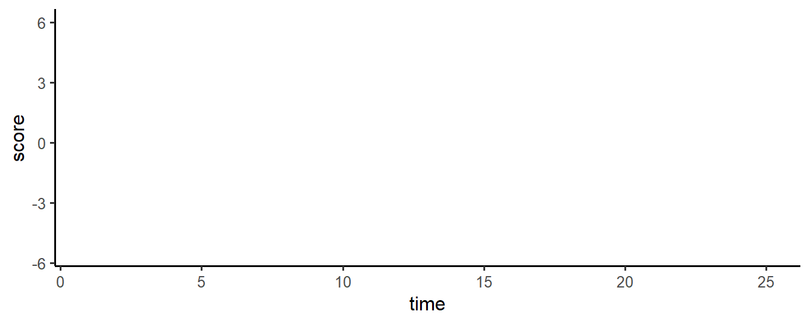
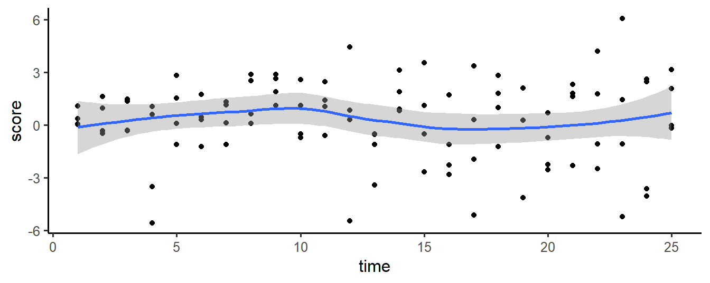
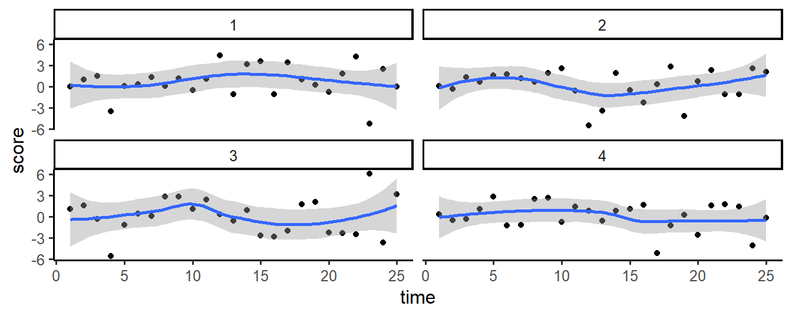

# R Packages for EMA Research {#rcat}

Many R packages exist that can help you in the management and analysis of EMA
data. In this chapter, a selection of these packages is discussed. For each, we
provide a summary description, example code, and pointers to further
documentation, to give you a head start in using these packages for your work.

Table: (\#tab:rcat) List of R packages that are useful in EMA research.

| **Category**    |**Package**        | **Description**                         |
|:----------------|:------------------|:----------------------------------------|
| **Actigraphy**  | GENEAread         | Import GENEActiv data. |
|                 | GGIR              | Import, pre-process and analyze accelerometer data.|
|                 | PhysicalActivity  | Analyze Actigraph accelerometer data.   | 
| **Data Management & Visual Exploration**| dplyr | Data transformation.            |
|                 | ggplot2           | Create graphs.                          |
|                 | haven             | Import and export SPSS data files.      |
|                 | lubridate         | Manipulate date and time variables.     |
| **Auto-regressive modeling**| autovarCore| Automate the construction of vector autoregressive models. |
| **Mixed-effects Modeling** | lme4   | Fit linear and nonlinear mixed-effects models. Fast alternative to package `nlme`.|   
|                 | nlme              | Fit linear and nonlinear mixed effects models. Pre-dates package `lme4`, but is still used because it a provides advanced options to model correlational structures |
| **Simulation**  | simr              | Simulation-based power calculations for mixed models.|
|                 | simstudy          | Simulate complex study data. | 
| **Symptom Networks**| bootnet       | Assess the stability of symptom networks.|
|                 | qgraph            | Estimate and plot symptom networks.|  
| **Time series analysis** | lomb     | Calculate the Lomb-Scargle Periodogram for unevenly sampled time series. |


## Actigraphy
\index{Actigraphy}

Accelerometer data need considerable pre-processing before final analyses can be
run. Raw data have to be read in from a variety of brand-specific file formats,
data have to re-calibrated on a per-device basis, non-wear periods have to
detected, and summarizing measures, such as activity counts and
energy-expenditure measures, have to be calculated from imputed triangular (x,
y, x) data, often in several time windows (i.e., epochs).

### GENEAread
\index{GENEAread}

[GENEActiv](https://www.geneactiv.org/) is a wrist-worn accelerometer that is
widely used in sleep and physical activity research. With package **GENEAread**
[@R_GENEAread], raw GENEActiv binary files can be imported into R for further
processing, as illustrated below.


```r
# Read raw GENEActiv data.
library(GENEAread)
dat <- read.bin(system.file("binfile/TESTfile.bin", package = "GENEAread"),
                  verbose = FALSE, downsample = 20)
d <- as.data.frame(dat$data.out)
d$timestamp <- as.POSIXct(d$timestamp, origin = "1970-01-01", tz = "UTC")
d[1:4, ]
```


timestamp                       x           y           z   light   button   temperature
----------------------  ---------  ----------  ----------  ------  -------  ------------
2012-05-23 16:47:50.0    0.023516   -0.887283   -0.100785       0        0          25.8
2012-05-23 16:47:50.2    0.027462   -0.933668   -0.140047       0        0          25.8
2012-05-23 16:47:50.4    0.035354   -1.150135   -0.030114       0        0          25.8
2012-05-23 16:47:50.5    0.070865   -3.229764   -0.619042       0        0          25.8

By having access to the raw data, you are free to explore the data further in
any you want. For instance, to plot the raw data captured by each sensor, type:


```r
# Plot raw GENEActiv data, with ggplot
library(ggplot2); library(tidyr)
d <- gather(d, key = "sensor", value = "value", -timestamp)
ggplot(d, aes(x = timestamp, y = value)) + 
  geom_line() + 
  facet_wrap(~sensor, scales = "free_y")
```

<div class="figure" style="text-align: center">

<p class="caption">(\#fig:genearead-plot-example)Raw sensor data of a GENEActiv accelerometer.</p>
</div>


### GGIR
\index{GGIR}

Package *GGIR* [@R-GGIR] is a package to pre-process raw accelerometry data from
three accelerometer brands: [ActiGraph](http://actigraphcorp.com/),
[Axivity](http://axivity.com/), and [GENEActiv](https://www.geneactiv.org/)
(GGIR includes package `GENEAread`). The package is in active development. New
features are introduced and bugs are fixed on a regular basis. If you consider
to use `GGIR` for your project, you may want to install the development version,
which is on [GitHub](https://github.com/wadpac/GGIR).


```r
library(devtools)
install_github("wadpac/GGIR", dependencies = TRUE)
```

`GGIR`'s main function is `g.shell.GGIR`, with which multiple accelerometer data
files can be imported, calibrated, cleaned (identify non-wear periods, impute
data) and analyzed (extract and summarize variables on physical activity and
sleep). The example below shows an example configuration (. See `?g.shell.GGIR`
(and `?g.part1`, ?`g.part2`, to `g.part4`) to learn the meaning of each
parameter. If you get lost or run into a problem, you can ask the package
developers or other users for help via the GGIR Google discussion forum, at
<https://groups.google.com/forum/#!forum/rpackageggir>.


```r
# Import actigraphy data with GGIR
library(GGIR)

g.shell.GGIR(
  # Shell configuration ---------------------------
  mode = c(1, 2, 3, 4), f1 = 2,
  datadir = "./data/raw/actigraphy/", 
  outputdir = "./data/cleaned/ggir",
  desiredtz = "Europe/Amsterdam",
  do.report = c(2, 4), visualreport = TRUE,
  overwrite = TRUE,
  # Part 1: import, calibrate, extract features ----
  do.anglez=TRUE,
  # Part 2: impute and summarize -------------------
  strategy = 1, maxdur = 8,
  hrs.del.start = 0, hrs.del.end = 0,
  includedaycrit = 10, mvpathreshold = c(125), 
  # Part 3: Sleep detection
  timethreshold = c(5), anglethreshold = 5,
  ignorenonwear = TRUE,
  # Part 4: sleep summaries ------------------------
  includenightcrit = 12,
)
```

<div class="figure" style="text-align: center">

<p class="caption">(\#fig:GGIR-pdf)sample GGIR output</p>
</div>

### PhysicalActivity
\index{PhysicalActivity}

Package *PhysicalActivity* [@R-PhysicalActivity] provides an alternative to
packages `GGIR` and `GENEAread`, when [ActiGraph](https://actigraphcorp.com/)
data are available.


```r
# Plotting activity counts.
library(PhysicalActivity)
library(ggplot2)

data(dataSec)

d <- dataCollapser(dataSec, TS = "TimeStamp", col = "counts", by = 300)

ggplot(d, aes(x = as.POSIXct(TimeStamp), y = counts)) +
  geom_line(size = .5, alpha = .5) +
  xlab("Time") + ylab("Activity Counts")
```

<div class="figure" style="text-align: center">

<p class="caption">(\#fig:fig15a)Activity Counts (5-minute windows), in a Three-day Accelerometer data set.</p>
</div>


## Autoregressive modeling

### autovarCore
\index{autovarCore}
\index{autovar}

\index{Vector autoregressive models}

Vector autoregressive (VAR) models can be used to detect lagged relationships
between multiple time-series (see also Chapter \@ref(features)). In VAR, each
variable is modeled as a linear function of past values (lags) of itself and of
present and past values of other variables. When EMA is used to capture multiple
phenomena over time, VAR can provide insight in how these phenomena interact.
One challenge in VAR modeling is that many alternative models potentially
exist, Package *autovarCore* [@R-autovarCore] was developed to help
researchers to find the VAR model with the best fit to a given time-series data
set. In the example below, function `autovar` is used to detect that
changes in depression are positively related to past (lag 1) values of activity,
in a simulated data set:


```r
# Autovar analysis.
library(autovarCore)

# simulate data
N = 100
depression <- rnorm(N)
activity <- rnorm(N)
activity_lag1 <- c(NA, activity[1:(N -1)])

depression <- depression + 0.5 * activity_lag1 
d <- data.frame(depression, activity)

models_found <- autovarCore::autovar(d, selected_column_names = c('activity', 'depression'))

# Show details for the best model found
summary(models_found[[1]]$varest$varresult$depression)
#> 
#> Call:
#> lm(formula = y ~ -1 + ., data = datares)
#> 
#> Residuals:
#>      Min       1Q   Median       3Q      Max 
#> -2.81442 -0.50094  0.06734  0.54927  2.49861 
#> 
#> Coefficients:
#>                 Estimate Std. Error t value Pr(>|t|)    
#> activity.l1    0.5813673  0.0925945   6.279 1.11e-08 ***
#> depression.l1 -0.0371659  0.0889408  -0.418   0.6770    
#> depression.l2  0.0152312  0.0901156   0.169   0.8662    
#> const         -0.3052847  0.3337492  -0.915   0.3627    
#> index          0.0273383  0.0148712   1.838   0.0692 .  
#> index2        -0.0003647  0.0001403  -2.598   0.0109 *  
#> ---
#> Signif. codes:  0 '***' 0.001 '**' 0.01 '*' 0.05 '.' 0.1 ' ' 1
#> 
#> Residual standard error: 0.9714 on 92 degrees of freedom
#> Multiple R-squared:  0.368,	Adjusted R-squared:  0.3336 
#> F-statistic: 10.71 on 5 and 92 DF,  p-value: 3.93e-08
```

`AutovarCore` is a simplified version of a more extensive package *autovar*
[@R-autovarCore], which was used in several publications
[@VanderKrieke2015; @Emerencia2016]. Further information can be found on
[http://autovar.nl](https://autovar.nl/) and
[http://autovarcore.nl](https://autovarcore.nl/)

## Data management & Visual Exploration
\index{tidyverse}

The *tidyverse* is a collection of well-designed packages, authored by the team
behind RStudio, that together add a consistent, modern, and efficient extension
of base R functions. The `tidyverse` includes popular packages such as
`ggplot2` (for plotting), `haven` (to read SPSS files), `dplyr` (for data
manipulation), and many more (see: <http://tidyverse.org> for a full list).

### dplyr
\index{dplyr}

Package *dplyr* [@R-dplyr] implements the 'split-apply-combine'-strategy.
With `dplyr`, elementary data manipulations can be e chained (using the pipe
operator `%\>%`) to elegantly implement complex data transformations. 


```r
# Aggregate data by ID, through a 'pipe'.
require(dplyr)

d <- data.frame(
  id = factor(rep(1:5, each = 10)), 
  score = rnorm(50)
)

b <- as_tibble(d) %>% 
  group_by(id) %>%
  summarize(mean = mean(score))

knitr::kable(b)
```


id          mean
---  -----------
1     -0.4841959
2     -0.2268515
3      0.0650939
4      0.0714066
5      0.1296515

A good introduction to `dplyr` can be found in the book 'R for Data Science'
[@wickham2016r], which can be freely accessed online
(<http://r4ds.had.co.nz/>).


### ggplot2
\index{ggplot2}

Package *ggplot2* [@wickham2016ggplot2] provides a collection of high-level
plotting commands with which graphs can be build up in layers. It is based on
'The Grammar of Graphics' [@wilkinson2006], an influential analysis of the
structure of scientific graphs. Systematic introductions are available on the
[the tidyverse website](http://ggplot2.tidyverse.org/), and in the book
'ggplot2: Elegant Graphics for Data Analysis' [@wickham2016ggplot2].

The example below illustrates how graphs are layered. In the first step, a
coordinate system is set up. In step 2, all time/scores points are plotted. In
step 3, a smoothed line is fitted through these points. Finally, in step 4, the
graph is split on a variable ID (a subject identifier), to show individual
trajectories.


```r
# Simple ggplot example.
library(ggplot2)

# simulate example data 
d = data.frame(
  ID    = rep(1:4, each = 25),
  time  = rep(1:25, 4), 
  score = rnorm(100, 0, 2))

# step 1: initialise the coordinate system
g <- ggplot(d, aes(x = time, y = score)); g

# step 2: add scatterplot
g <- g + geom_point(); g

# step 3: add a smoothed line
g <- g + geom_smooth(method = "loess"); g

# step 4: split plot by subject ID
g + facet_wrap(~ ID)
```

<div class="figure" style="text-align: center">

<p class="caption">(\#fig:ggplot2-example)Plotting layers with ggplot2</p>
</div>


### haven
\index{haven}
\index{SPSS}

With package *haven* [@R-haven], SPSS, STATA and SAS files can be read into R.
A particular advantage of the `read.sav` function is that SPSS variables
definitions are retained (in attributes of the columns in the R `data.frames`).


```r
# Read SPSS data
library(haven)

# read example data (included in package)
path <- system.file("examples", "iris.sav", package = "haven")
d <- read_sav(path)

# show attributes of variable
attributes(d$Species)
#> $format.spss
#> [1] "F8.0"
#> 
#> $class
#> [1] "labelled"
#> 
#> $labels
#>     setosa versicolor  virginica 
#>          1          2          3
```

### lubridate
\index{Datetime variables}
\index{lubridate}

EMA data analyses frequently require manipulations of date-time variables. For
this, package *lubridate* [@R-lubridate], which provides many functions for
common date and date time operations, can be very useful.

In the code snippet below, for example, the `round_date` function is used to
calculate the ENMO value from raw tri-axial accelerometer data (see Chapter
\@ref(activity)), in 15-minute epoch windows.


```r
# Rounding datetime variables with lubridate.
library(emaph)
library(lubridate)
library(ggplot2)
library(dplyr)

d <-  subset(geneactiv,
              timestamp > "2018-06-02 12:00" &
              timestamp < "2018-06-02 18:00")

# round timestamp
d$epoch <- round_date(d$timestamp, "15 minutes")

# summarize x, y, z acceleration to ENMO
d <- d %>% group_by(id, epoch) %>% 
  summarise(svm = sum(sqrt(x^2 + y^2 + z^2) -1) / n())
```


 id  epoch                        svm
---  --------------------  ----------
  1  2018-06-02 12:00:00    0.0235192
  1  2018-06-02 12:15:00    0.0486871
  1  2018-06-02 12:30:00    0.0477664
  1  2018-06-02 12:45:00    0.0128911
  1  2018-06-02 13:00:00    0.0005558
  1  2018-06-02 13:15:00    0.0027089

To learn more about handling dates and times with `lubridate`,
[Chapter 16](http://r4ds.had.co.nz/dates-and-times.html) of the book 'R for Data
Science' [@wickham2016r] provides a good introduction.


## Mixed-effects Modeling
\index{Mixed effects}

Several R-packages for mixed-effects modeling exist. The most popular are
package *nlme* [@R-nlme] and package *lme4* [@Bates2015]. Both packages are
actively used, as both provide unique functionalities.


### nlme
\index{nlme}

Package *nlme* is introduced in Chapter \@ref(lmm). It is an older package (in
comparison to `lme4`), that is still used a lot because it provides
options to model correlational structures that are not implemented (yet) in
`lme4`.


```r
# Fit a linear mixed model, with lme.
library(nlme)
fm <- lme(distance ~ age + Sex, data = Orthodont, random = ~ 1)

fixef(fm)
#> (Intercept)         age   SexFemale 
#>  17.7067130   0.6601852  -2.3210227
```

### lme4
\index{lme4}

Package *lme4* [@Bates2015] is a faster reimplementation of the
mixed-effects model. With large data sets and complex hierarchical models, this
package should probably be preferred. As can be seen below, model specifications
in `lmer` are different from model specifications in `lme`.


```r
# Fit a linear mixed model, with lme.
library(lme4)
fm <- lmer(distance ~ age + Sex + (1 | Subject), data = nlme::Orthodont)

fixef(fm)
#> (Intercept)         age   SexFemale 
#>  17.7067130   0.6601852  -2.3210227
```

## Simulation

### simr
\index{simr}

With package *simr* [@Green2016], power of mixed-effects models can be
determined via simulation. As illustrated below, the procedure requires the
researcher to define the true parameters of a mixed model, and a single data
set. Next, function `simPower` can be used to simulate new data sets and tests
(of a specified parameter in the model), to determine the power of the test.


```r
# Power analysis of a two-group repeated measures design
# (simulation approach).
library(simr)

# construct design matrix 
time <- 1:24
subject <- 1:40
X   <- expand.grid(time = time, subject = subject)
X$group <- c(rep(0, 24), rep(1, 24)) # group

# fixed intercept and slope
b <- c(2, -0.1, 0, -0.5)

# random intercept variance
V1 <- 0.5                     

# random intercept and slope variance-covariance matrix
V2 <- matrix(c(0.5, 0.05, 0.05, 0.1), 2) 

# residual standard deviation
s <- 1 

model1 <- makeLmer(y ~ time * group + (1 + time | subject), 
                   fixef = b, 
                   VarCorr = V2, 
                   sigma = s, 
                   data = X)

powerSim(model1, 
         fixed("time:group", "lr"), 
         nsim = 10, # set to high value for better results
         progress = FALSE)
#> Power for predictor 'time:group', (95% confidence interval):
#>       100.0% (69.15, 100.0)
#> 
#> Test: Likelihood ratio
#>       Effect size for time:group is -0.50
#> 
#> Based on 10 simulations, (0 warnings, 0 errors)
#> alpha = 0.05, nrow = 960
#> 
#> Time elapsed: 0 h 0 m 2 s
```


### simstudy


```r
library(simstudy)

def <- defData(varname = "nr", dist = "nonrandom", formula = 7, id = "idnum")
def <- defData(def, varname = "x1", dist = "uniform", formula = "10;20")
def <- defData(def, varname = "y1", formula = "nr + x1 * 2", variance = 8)

genData(5, def)
#>    idnum nr       x1       y1
#> 1:     1  7 16.08567 39.47196
#> 2:     2  7 12.46348 32.27785
#> 3:     3  7 17.84386 46.95338
#> 4:     4  7 19.47801 43.35452
#> 5:     5  7 11.26391 29.32974
```


## Symptom Network Analysis
\index{Symptom networks}
\index{Network analysis}

When EMA is used to tap various symptoms, network analysis can reveal the
dynamic interplay between these symptoms [@Borsboom2013; @Borsboom2017;
@Bringmann2015]. Various packages exist to fit these networks in R. With these
packages, it is relatively easy to fit a graphical network on multivariate data
sets. If you are interested in conducting a network analysis, be sure to visit
the Psycho-systems website, at <http://psychosystems.org>, or to register for
the UvA network school course (see: <http://psychosystems.org/NetworkSchool>). A
complete list of software related to network analysis from the Psycho-systems
group is maintained at <http://psychosystems.org/software/>. Excellent tutorials
can also be found at <http://psych-networks.com/tutorials/> and at
<http://sachaepskamp.com/files/Cookbook.html>.

### qgraph
\index{qgraph}

Package *qgraph* [@Epskamp2012] can be used to fit, visualize and analyze
graphical networks.

In the example below, `qgraph` is used to fit a network on the 'Critical Slowing
Down' (CSD) data set, which is included in package `emaph` (see Chapter
\@ref(csd)).


```r
# Fitting a network, with qgraph.

library(qgraph)
library(emaph)

# get mood_ scores from csd data set
d <- subset(csd, 
            subset = phase == "exp: db: no change", 
            select = grep("mood_", names(csd))[1:5])


# Fit and plot regularized partial correlation network
g <- qgraph(cor_auto(d, detectOrdinal = FALSE),
       graph = "glasso", sampleSize = nrow(d),
       nodeNames = names(d),
       label.scale = FALSE, label.cex = .8, 
       legend = TRUE, legend.cex = .5,
       layout = "spring")
```

<div class="figure" style="text-align: center">

<p class="caption">(\#fig:qgraph-example)Network of mood items from CSD data set</p>
</div>

Package `qgraph` also provides functions to analyze qualities of fitted networks, such as the centrality of nodes in the network. In the network plot above, node `md_s` appears to be a central node in the network. This is confirmed by calling `centralityPlot`:   


```r
centralityPlot(g)
```


### bootnet
\index{bootnet}

In the interpretation of fitted networks, it is important to take the stability
of the network into account. Intuitively, networks that are fit on small sample
data sets will be less stable than networks based on large data sets. One
solution is to asses this is to fit a large number of networks on subsets of the
original data, via bootstrapping. In stable networks, the variability of edge
estimations and other characteristics will be small, while in unstable networks,
the variance will be large. This idea is implemented in package *bootnet*
[@Epskamp2018a].

Below, the stability of the network that was fit in the previous example is
examined with `bootnet`: fifty networks are fit, based on fifty bootstrapped
samples. In the results plot, the red line marks the strength of the edges in
the full sample, while grey confidence intervals mark the distribution of the
edge weights in the bootstraps.


```r
# A bootstrapped network. 
library(bootnet)

g <- estimateNetwork(d, default = "EBICglasso",
                     corArgs = list(detectOrdinal = FALSE))
results <- bootnet(g, nBoots = 50, verbose = FALSE)
plot(results, order = "mean")
```


## Timeseries analysis

### lomb
\index{Lomb-Scargle periodogram}
\index{Unevenly-sampled timeseries}
\index{lomb}

Disturbances in circadian rhythms have been related to depressive symptoms
[see, e.g., @Saeb2015]. With so-called periodograms, these circadian rhythms
can be detected in EMA data (see Chapter \@ref(features)). Standard analysis
techniques, however, expect regular time-series, in which data are sampled at
equidistant intervals. EMA data, typically, are not equidistant. One solution to
this problem is to use the Lomb-Scargle periodogram procedure [@Lomb1976],
which can be applied to unevenly-sampled time-series as well. Package *lomb*
[@ruf1999] implements this procedure.


```r
# Calculating a Lomb-Scargle periodogram.
data(ibex, package = "lomb") 
lomb::lsp(ibex[2:3]) 
```


