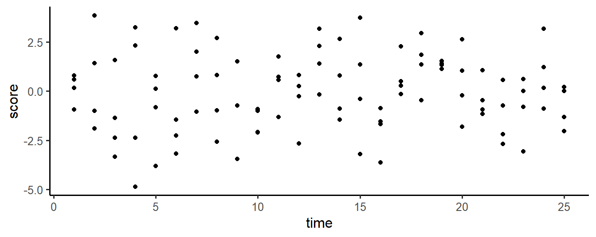
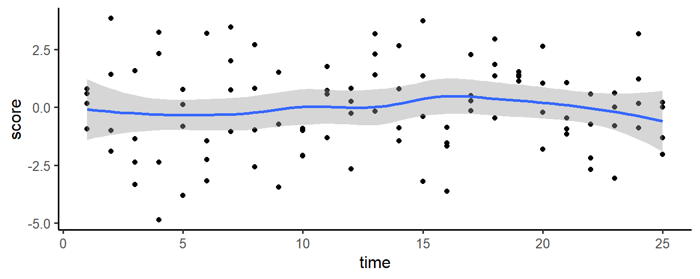
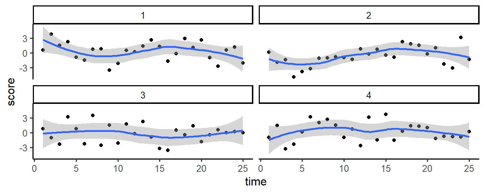
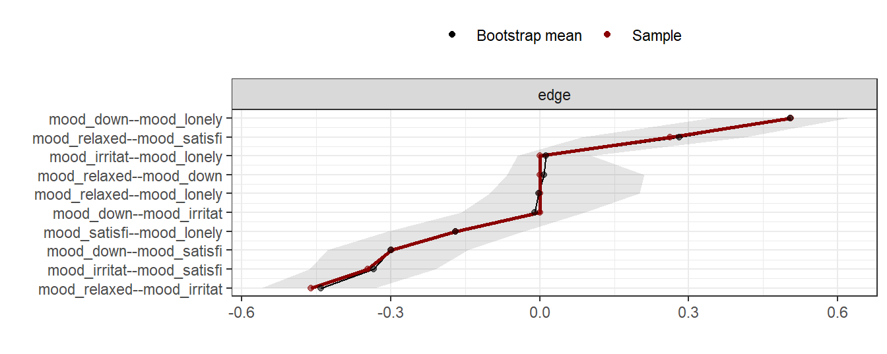

# R Packages for EMA Research {#rcat}

Many R packages exist that can help you in the management and analysis of EMA
data. In this chapter, a selection of these packages is discussed. For each, we
provide a summary description, a code example code, and pointers to further
documentation, to give you a head start in using the packages for your work.

Table: (\#tab:rcat) List of R packages that are useful in EMA research.

+-----------------+-------------------+-----------------------------------------+
| **Category**    |**Package**        | **Description**                         |
+:================+:==================+:========================================+
| Accelerometry   | GENEAread         | Import GENEActive data into R           |
+-----------------+-------------------+-----------------------------------------+
|                 | GGIR              | Pre-process and analyze raw multi-day    |
|                 |                   | multi-day accelerometer data.           | 
+-----------------+-------------------+-----------------------------------------+
|                 | PhysicalActivity  | Analyze actigraph accelerometer data.   | 
+-----------------+-------------------+-----------------------------------------+
| Data Management | dplyr             | Data transformation                     | 
| & Visual        |                   |                                         |
| Exploration     |                   |                                         |
+-----------------+-------------------+-----------------------------------------+
|                 | ggplot2           | Create graphs                           |
+-----------------+-------------------+-----------------------------------------+
|                 | haven             | Import and export SPSS data files       |
+-----------------+-------------------+-----------------------------------------+
|                 | lubridate         | Manipulate date and time variables      |
+-----------------+-------------------+-----------------------------------------+
| Mixed-effects   | lme4              | Fit linear and nonlinear mixed-effects  |
| Modeling        |                   | models. Fast alternative to             |
|                 |                   | package 'nlme'.                         |
+-----------------+-------------------+-----------------------------------------+
|                 | nlme              | Fit linear and nonlinear mixed effects  |
|                 |                   | models. Pre-dates package 'lme4', but is|
|                 |                   | still used because it a provides more   |
|                 |                   | advanced options to model correlational |
|                 |                   | structures in the data.                 |
+-----------------+-------------------+-----------------------------------------+
| Power Analysis  | simr              | Simulation-based power calculations for |
|                 |                   | mixed models.                           | 
+-----------------+-------------------+-----------------------------------------+
| Simulation      | simstudy          | Simulate study data.                    | 
+-----------------+-------------------+-----------------------------------------+
| Spatio-temporal | adehabitatHR      | Developed for home range estimation of  |
| analysis        |                   | wild animals from GPS data. Useful for  |
|                 |                   | human data as well.                     | 
+-----------------+-------------------+-----------------------------------------+
| Symptom Networks| autovarCore       | Automate the construction of vector     |     
|                 |                   | autoregressive models.                  |
+-----------------+-------------------+-----------------------------------------+
|                 | bootnet           | Assess the stability of symptom         |
|                 |                   | networks.                               |
+-----------------+-------------------+-----------------------------------------+
|                 | qgraph            | Estimate and plot symptom networks.     |  
+-----------------+-------------------+-----------------------------------------+
| Time series     | lomb              | Calculate the Lomb-Scargle Periodogram  |
| analysis        |                   | for unevenly sampled time series.       |
+-----------------+-------------------+-----------------------------------------+


## Accelerometry

Accelerometer data need considerable pre-processing before final analyses can be
run. Raw data have to be read in from a variety of brand-specific file formats,
data have to re-calibrated on a per-device basis, non-wear periods have to
detected, and summarizing measures, such as activity counts and
energy-expenditure measures, have to be calculated from imputed triangular (x,
y, x) data, often in several time windows (i.e., epochs). 

### Package GENEAread

GENEActive, sold by Activinsights, is a wrist-worn tri-axial accelerometer that
is often used in clinical research studies. With package **GENEAread**
[@R_GENEAread], raw data can be imported into R for further processing, as
illustrated below.   


```r
# Reading raw GENEActive data.
library(GENEAread)
library(tidyr)

dat <- read.bin(system.file("binfile/TESTfile.bin", package = "GENEAread"),
                verbose = FALSE, downsample = 20)
#> Processing took: 0.091 secs .
#> Loaded 1560 records (Approx  0 MB of RAM)
#> 12-05-23 16:47:50.000 (Wed)  to  12-05-23 16:53:01.799 (Wed)

d <- as.data.frame(dat$data.out)
d <- gather(d, key = "sensor", value = "value", -timestamp)
d$timestamp <- as.POSIXct(d$timestamp, 
                          origin = "1970-01-01",
                          tz = "UTC")

ggplot(d, aes(x = timestamp, y = value)) + 
  geom_line() + 
  facet_wrap(~sensor, scales = "free_y")
```

<div class="figure" style="text-align: center">

<p class="caption">(\#fig:unnamed-chunk-2)Raw sensor data of a GENEActive wrist-worn tri-axial accelerometer (down-sampled from 100Hz to 5Hz).</p>
</div>


### Package 'GGIR'
\index{Packages!GGIR}

Package *GGIR* [@R-GGIR] is a package to pre-process raw accelerometry data
from three brands of wearables that are widely used in sleep and physical
activity research: [GENEActiv](https://www.geneactiv.org/),
[ActiGraph](http://actigraphcorp.com/) and [Axivity](http://axivity.com/).


### Package 'PhysicalActivity'
\index{Packages!PhysicalActivity}

Package *PhysicalActivity* [@R-PhysicalActivity] provides an alternative to
package `GGIR`, when ActiGraph data are available.


```r
# Plotting activity counts.
library(PhysicalActivity)
library(ggplot2)

data(dataSec)

d <- dataCollapser(dataSec, TS = "TimeStamp", col = "counts", by = 300)

ggplot(d, aes(x = as.POSIXct(TimeStamp), y = counts)) +
  geom_line(size = .5, alpha = .5) +
  xlab("Time") + ylab("Activity Counts")
```

<div class="figure" style="text-align: center">

<p class="caption">(\#fig:fig15a)Activity Counts (5-minute windows), in a Three-day Accelerometer data set.</p>
</div>


## Data management & Visual Exploration
\index{Packages!tidyverse}

The *tidyverse* is a collection of well-designed packages, authored by the team
behind RStudio, that together add a consistent, modern, and efficient extension
of base R functions. The `tidyverse` includes popular packages such as
`ggplot2` (for plotting), `haven` (to read SPSS files), `dplyr` (for data
manipulation), and many more (see: <http://tidyverse.org> for a full list).

### Package `dplyr`
\index{Packages!dplyr}

Package *dplyr* [@R-dplyr] implements the 'split-apply-combine'-strategy.
With `dplyr`, elementary data manipulations can be e chained (using the pipe
operator `%\>%`) to elegantly implement complex data transformations. 


```r
# Aggregate data by ID, through a 'pipe'.
require(dplyr)

d <- data.frame(
  c = factor(rep(1:5, each = 10)), 
  score = rnorm(50)
)

b <- as_tibble(d) %>% 
  group_by(c) %>%
  summarize(mean_score = mean(score))
```

A good introduction to `dplyr` can be found in the book 'R for Data Science'
[@wickham2016r], which can be freely accessed online
(<http://r4ds.had.co.nz/>).


### Package 'ggplot2'
\index{Packages!ggplot2}

Package *ggplot2* [@wickham2016ggplot2] provides a collection of high-level
plotting commands with which graphs can be build up in layers. It is based on
'The Grammar of Graphics' [@wilkinson2006], an influential analysis of the
structure of scientific graphs. Systematic introductions are available on the
[the tidyverse website](http://ggplot2.tidyverse.org/), and in the book
'ggplot2: Elegant Graphics for Data Analysis' [@wickham2016ggplot2].

The example below illustrates how graphs are layered. In the first step, a
coordinate system is set up. In step 2, all time/scores points are plotted. In
step 3, a smoothed line is fitted through these points. Finally, in step 4, the
graph is split on a variable ID (a subject identifier), to show individual
trajectories.


```r
# Simple ggplot example.
library(ggplot2)

# simulate example data 
d = data.frame(
  ID    = rep(1:4, each = 25),
  time  = rep(1:25, 4), 
  score = rnorm(100, 0, 2))

# step 1: initialise the coordinate system
g <- ggplot(d, aes(x = time, y = score)); g

# step 2: add scatterplot
g <- g + geom_point(); g

# step 3: fit a smoothed line
g <- g + geom_smooth(); g

# step 4: split plot by ID
g + facet_wrap(~ ID)
```

<div class="figure" style="text-align: center">

<p class="caption">(\#fig:cs15d)Plotting layers with ggplot2</p>
</div>


### Package 'haven'
\index{Packages!haven}
\index{SPSS}

With package *haven* [@R-haven], SPSS, STATA and SAS files can be read into R.


```r
# Read SPSS data
library(haven)

path <- system.file("examples", "iris.sav", package = "haven")
d <- read_sav(path)

attributes(d$Species)
#> $format.spss
#> [1] "F8.0"
#> 
#> $class
#> [1] "labelled"
#> 
#> $labels
#>     setosa versicolor  virginica 
#>          1          2          3
```

### Package 'lubridate'
\index{Datetime variables}
\index{Packages!lubridate}

EMA data analyses frequently require manipulations of date-time variables. For
this, package *lubridate* [@R-lubridate], which provides many functions for
common date and date time operations, can be very useful.

In the code snippet below, for example, the `round_date` function is used to
calculate the ENMO value from raw tri-axial accelerometer data, in 15-minute
epoch windows.


```r
# Rounding dates.
library(emaph)
library(lubridate)
library(ggplot2)
library(dplyr)

d <-  subset(genea,
              timestamp > "2018-06-02 12:00" &
              timestamp < "2018-06-02 18:00")
d$epoch <- round_date(d$timestamp, "minute")

d <- d %>% group_by(id, epoch) %>% 
  summarise(svm = sum(sqrt(x^2 + y^2 + z^2) -1) / length(x))
```


 id  epoch                         svm
---  --------------------  -----------
  1  2018-06-02 12:00:00    -0.0009766
  1  2018-06-02 12:01:00     0.0072235
  1  2018-06-02 12:02:00     0.0023875
  1  2018-06-02 12:03:00     0.0070644
  1  2018-06-02 12:04:00     0.0265187
  1  2018-06-02 12:05:00     0.0969168

To learn more about handling dates and times with `lubridate`,
[Chapter 16](http://r4ds.had.co.nz/dates-and-times.html) of the book 'R for Data
Science' [@wickham2016r] provides a good introduction.


## Mixed-effects modeling
\index{mixed effects}

Several R-packages for mixed-effects modelling exist. The most popular are
package *nlme* [@R-nlme] and package *lme4* [@Bates2015]. Both packages are
actively used, as both provide unique functionalities.


### nlme
\index{Packages!nlme}

Package *nlme* is introduced in Chapter \@ref(lmm). It is an older package (in
comparison to `lme4`), that is still used a lot because it provides
options to model correlational structures that are not implemented (yet) in
`lme4`.


```r
# Fit a linear mixed model, with lme.
library(nlme)
fm <- lme(distance ~ age + Sex, data = Orthodont, random = ~ 1)

fixef(fm)
#> (Intercept)         age   SexFemale 
#>  17.7067130   0.6601852  -2.3210227
```

### lme4
\index{Packages!lme4}

Package *lme4* [@Bates2015] is a faster reimplementation of the
mixed-effects model. With large data sets and complex hierarchical models, this
package should probably be preferred. As can be seen below, model specifications
in `lmer` are different from model specifications in `lme`.


```r
# Fit a linear mixed model, with lme.
library(lme4)
fm <- lmer(distance ~ age + Sex + (1 | Subject), data = Orthodont)

fixef(fm)
#> (Intercept)         age   SexFemale 
#>  17.7067130   0.6601852  -2.3210227
```

## Power analysis

### Package 'simr'
\index{Packages!simr}

With package *simr* [@Green2016], power of mixed-effects models can be
determined via simulation. As illustrated below, the procedure requires the
researcher to define the true parameters of a mixed model, and a single data
set. Then, function `simPower` can be used to simulate new data sets and tests
(of a specified parameter in the model), to determine the power of the test.


```r
# Power analysis of a two-group repeated measures design
# (simulation approach).
library(simr)

# construct design matrix 
t <- 1:24
s <- 1:40 
X   <- expand.grid(t = t, s = s)
X$g <- c(rep(0, 24), rep(1, 24))

# fixed intercept and slope
b <- c(2, -0.1, 0, -0.5)

# random intercept variance
V1 <- 0.5                     

# random intercept and slope variance-covariance matrix
V2 <- matrix(c(0.5, 0.05, 0.05, 0.1), 2) 

# residual standard deviation
s <- 1 

model1 <- makeLmer(y ~ t * g + (1 + t | s), 
                   fixef = b, 
                   VarCorr = V2, 
                   sigma = s, 
                   data = X)

powerSim(model1, 
         fixed("t:g", "lr"), 
         nsim = 10,
         progress = FALSE)
#> Power for predictor 't:g', (95% confidence interval):
#>       100.0% (69.15, 100.0)
#> 
#> Test: Likelihood ratio
#>       Effect size for t:g is -0.50
#> 
#> Based on 10 simulations, (0 warnings, 0 errors)
#> alpha = 0.05, nrow = 960
#> 
#> Time elapsed: 0 h 0 m 2 s
```


## Symptom Network Analysis
\index{Symptom networks}

When EMA is used to tap various symptoms, network analysis can reveal the
dynamic interplay between these symptoms [@Borsboom2013]. Various packages
exist to fit these networks in R. With these packages, it is relatively easy to
fit a graphical network on multivariate data sets. If you are interested in
conducting a network analysis, be sure to visit the Psycho-systems website, at
<http://psychosystems.org>.


### Package 'autovarCore`
\index{Packages!autovarCore}
\index{Packages!autovar}

\index{Vector autoregressive models}

Vector auto-regressive (VAR) models can be used to detect lagged relationships
between multiple time-series. In VAR, each variable is modeled as a linear
function of past values (lags) of itself and of present and past values of other
variables. When EMA is used to capture multiple phenomena over time, VAR can
provide insight in how these phenomena interact. One challenge in VAR modelling
is that many alternative models potentially exist, Package *autovarCore*
[@R-autovarCore] was developed to help researchers to find the VAR model with
the best fit to a given time-series data set.

In the (unrealistic) example below, function `autovar` is used to detect that
changes in depression are positively related to past (lag 1) values of activity,
in a simulated data set:


```r
# Autovar analysis.
library(autovarCore)

# simulate data
N = 100
depression <- rnorm(N)
activity <- rnorm(N)
activity_lag1 <- c(NA, activity[1:(N -1)])

depression <- depression + 0.5 * activity_lag1 
d <- data.frame(depression, activity)

models_found <- autovarCore::autovar(d, selected_column_names = c('activity', 'depression'))

# Show details for the best model found
summary(models_found[[1]]$varest$varresult$depression)
#> 
#> Call:
#> lm(formula = y ~ -1 + ., data = datamat)
#> 
#> Residuals:
#>      Min       1Q   Median       3Q      Max 
#> -3.04624 -0.81161  0.06749  0.56598  3.03485 
#> 
#> Coefficients:
#>               Estimate Std. Error t value Pr(>|t|)    
#> activity.l1    0.66743    0.10792   6.184 1.52e-08 ***
#> depression.l1  0.19918    0.08983   2.217    0.029 *  
#> const          0.07751    0.10864   0.713    0.477    
#> ---
#> Signif. codes:  0 '***' 0.001 '**' 0.01 '*' 0.05 '.' 0.1 ' ' 1
#> 
#> Residual standard error: 1.076 on 96 degrees of freedom
#> Multiple R-squared:  0.3012,	Adjusted R-squared:  0.2866 
#> F-statistic: 20.69 on 2 and 96 DF,  p-value: 3.386e-08
```

`AutovarCore` is a simplified version of a more extensive package *autovar*
[@R-autovarCore], which was used in several publications
[@VanderKrieke2015, @Emerencia2016]. Further information can be found on
[http://autovar.nl](https://autovar.nl/) and
[http://autovarcore.nl](https://autovarcore.nl/)


### Package 'qgraph`
\index{Packages!qgraph}

Package *qgraph* [@Epskamp2012] can be used to fit, visualize and analyze
graphical networks.

In the example below, `qgraph` is used to fit a network on the 'Critical Slowing
Down' (CSD) data set, which is included in package `emaph` (see Chapter
\@ref(csd)).


```r
# Fitting a network, with qgraph.

library(qgraph)
library(emaph)

# get mood_ scores from csd data set
d <- subset(csd, 
            subset = phase == "exp: db: no change", 
            select = grep("mood_", names(csd))[1:5])


# Fit and plot regularized partial correlation network
g <- qgraph(cor_auto(d, detectOrdinal = FALSE),
       graph = "glasso", sampleSize = nrow(d),
       nodeNames = names(d),
       label.scale = FALSE, label.cex = .8, 
       legend = TRUE, legend.cex = .5,
       layout = "spring")
```

<div class="figure" style="text-align: center">

<p class="caption">(\#fig:cs15l)Network of mood items from CSD data set</p>
</div>


### Package 'bootnet'
\index{Packages!bootnet}

In the interpretation of fitted network plots, it is important to take the
stability of the network into account. Intuitively, networks that are fit on
small sample data sets will be less stable than networks based on large data
sets. One solution is to fit a large number of networks on subsets of the
original data, through bootstrapping. In stable networks, the variance of edges
estimations will be small, while in unstable networks, the variance will be
large. This idea is implemented in package *bootnet* [@Epskamp2018a].

Below, the stability of the network that was fit in the previous example is
examined with `bootnet`: fifty networks are fit, based on fifty bootstrapped
samples. In the results plot, the red line marks the strength of the edges in
the full sample, while grey confidence intervals mark the distribution of the
edge weights in the bootstraps.


```r
# A bootstrapped network. 
library(bootnet)

g <- estimateNetwork(d, default = "EBICglasso",
                     corArgs = list(detectOrdinal = FALSE))
results <- bootnet(g, nBoots = 50, verbose = FALSE)
plot(results, order = "mean")
```




## Timeseries analysis

### Package 'lomb'
\index{Lomb-Scargle periodogram}
\index{unevenly-sampled timeseries}

Disturbances in circadian rhythms have been related to depressive symptoms
[see, e.g., @Saeb2015]. With so-called periodograms, these circadian rhythms
can be detected in EMA data (see Chapter \@ref(features)). Standard analysis
techniques, however, expect regular time-series, in which data are sampled at
equidistant intervals. EMA data, typically, are not equidistant. One solution to
this problem is to use the Lomb-Scargle periodogram procedure [@Lomb1976],
which can be applied to unevenly-sampled time-series as well. Package *lomb*
[@ruf1999] implements this procedure.


```r
# Calculating a Lomb-Scargle periodogram.
data(ibex, package = "lomb") 
lomb::lsp(ibex[2:3]) 
```


