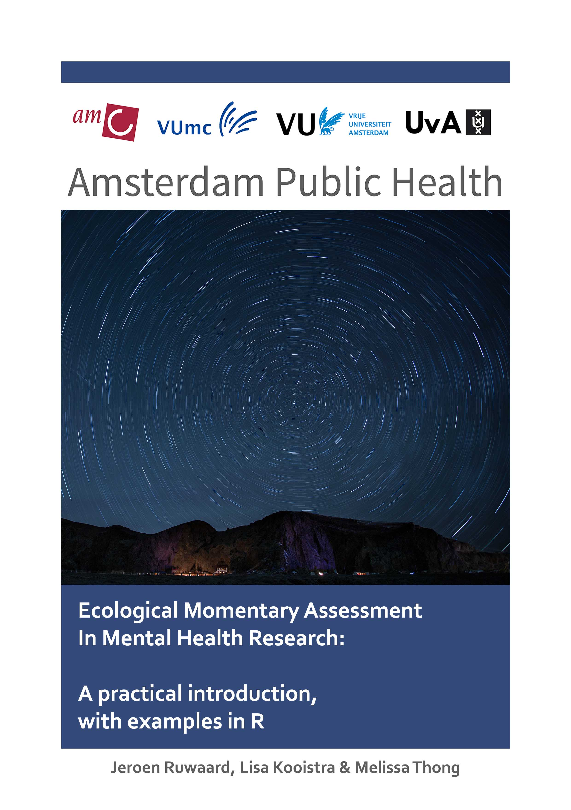

--- 
title: "Ecological Momentary Assessment in Mental Health Research"
subtitle: "A Practical Introduction, with Examples in R (1st edition)"
author: ["Jeroen Ruwaard", "Lisa Kooistra", "Melissa Thong"]
date: "2018-11-19"
cover-image: "images/cover/smallcover.jpg"
site: bookdown::bookdown_site
documentclass: book
bibliography: [book.bib, packages.bib]
biblio-style: apa
link-citations: yes
description: "This is an Amsterdam Public Health (APH) Research Manual, written for 
researchers who are planning Ecological Momentary Assessment (EMA) studies."
---

# Preface {-}

Given known limitations of retrospective self-report questionnaires, such as
recall bias and poor generalizability of assessment results to real-life
situations, mental health researchers increasingly adopt alternative assessment
methods. One of the promising alternatives is Ecological Momentary Assessment
(EMA), in which emotions and behaviors are repeatedly sampled in everyday life,
through wearable electronic devices.

Repeated measurement can reveal important characteristics of the dynamics of
phenomena, as illustrated by the cover of this book. With EMA, we can tap into
mental health processes that were, up to very recently, unavailable to
scientific research.

Conducting an EMA study, however, can be challenging. Researchers face a
dazzling array of options related to the electronic wearables, outcomes
selection, study design considerations, ethical and regulatory constraints, data
management, statistical analysis, and study reporting. Although standards are
emerging, clear guidelines for EMA research do not - at present - exist. EMA
studies have unique characteristics that require specialist research skills,
related to study design and statistical analysis. This manual was written to
fill this gap.

The manual provides a practical introduction to EMA-research. It was written to
aid beginning researchers of the Amsterdam School of Public Health (APH), who
are looking for practical advice in conducting EMA studies. The manual provides
an overview of EMA instruments, outcomes, methods and analytic techniques,
guidelines for EMA-studies, and a catalogue of EMA research in the APH
consortium.

This manual is available online at <https://jruwaard.github.io/aph_ema_handbook/>. Sources are available at <https://github.com/jruwaard/aph_ema_handbook>. Please post your comments and suggestions there, or via e-mail, through <aph.ema@ggzingeest.nl>.

This manual will be continuously updated. In citations, please include explicit 
build dates, as in:

Ruwaard, J., Kooistra, L. and Thong, M. (2018). *Ecological Momentary Assessment
in Mental Health Research: A Practical Introduction, with Examples in R (1st
edition - build 2018-11-19)*. Amsterdam: APH Mental Health. 
