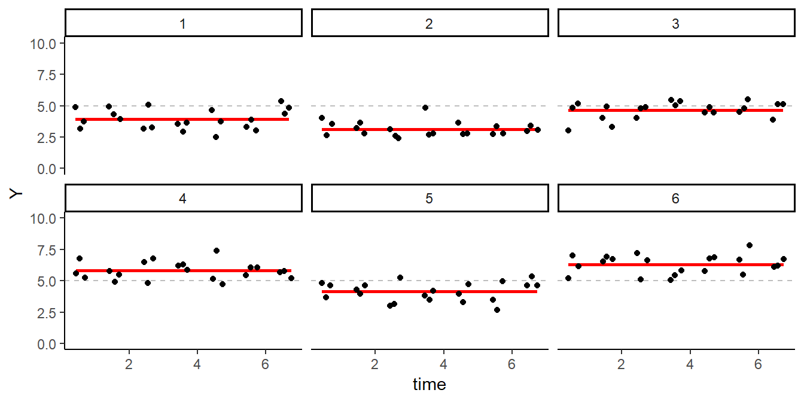
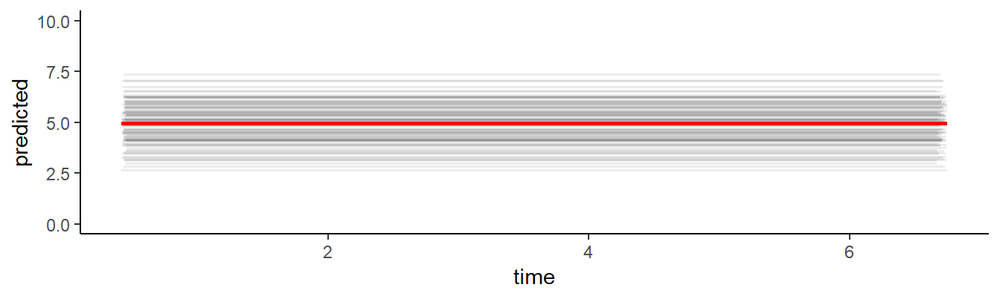
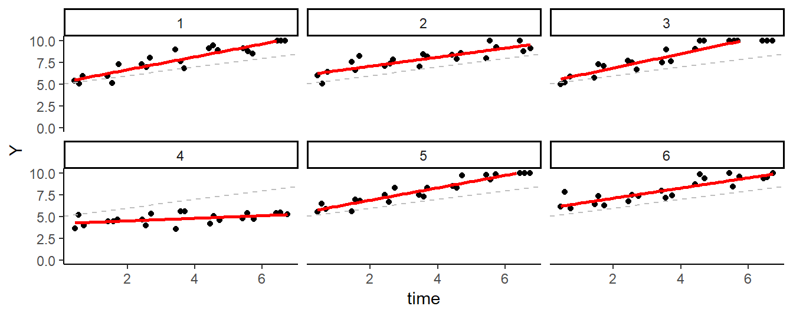
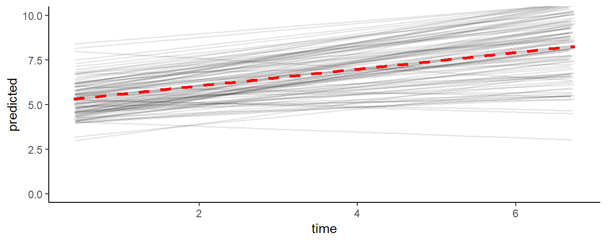
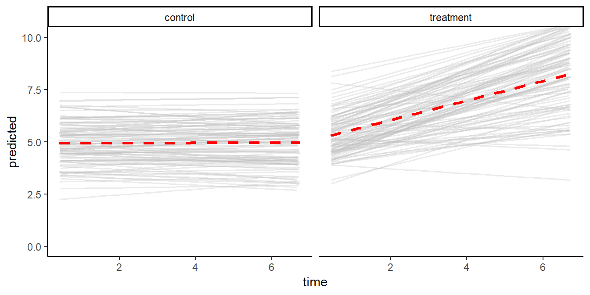

# Mixed Modeling {#lmm}
\index{Mixed Modeling}


EMA data are time-series that are characterized by complex correlational
structures, irregular sampling intervals, missing data, and substantive
individual differences. Mixed models are well-suited to deal with these data.
This chapter provides a brief introduction to conducting mixed model analysis of
EMA data in R.

## The Mixed Model
\index{Fixed effects}
\index{Random effects}

Mixed modeling can be understood as a regression technique in which separate
regression functions are estimated for each cluster in the data set. In EMA
data, these clusters are defined by the participants. Data from the same
participant are expected to be correlated, and one way to honor this correlation
is to conceptualize a separate regression for each participant. This idea, in
the simplest regression model, can be expressed as:

\begin{equation} 
  Y_{ij} = intercept_{i} + \epsilon_{ij} 
\end{equation} 

This models the expected value of the j-th measurement of participant i as the
mean of all measurements of participant i, plus error. It defines a set of
regression functions - one for each participant. The regression functions are,
however, not independent. Mixed models divide the intercepts of the individual
participant regression functions into two components: 1) the intercept of the
group (*intercept~g~*; the mean intercept of all regression functions), and 2)
a participant-specific component *intercept~p~* (i.e., the difference between
the intercept of the participant and the mean intercept), i.e.:

\begin{equation} 
  intercept_{i} = intercept_{g} + intercept_{p} 
\end{equation} 

The group intercept is called the 'fixed' effect. If we would gather more data
from new participants, we would expect to find approximately the same group
intercept. The participant-specific component of the intercept is known as the
'random' effect. If we sample new data, we would expect a similar *variance* of
the participant-specific intercept components around the group intercept. This
"mixing" of fixed and random effects is what gives mixed modeling its name.


## Simulating Example Data
\index{Simulating data} 

To understand analysis techniques, it often helps to apply the technique to
simulated data, in which parameters of interest are known. Here, we will use the
`sim_ema` function from package `emaph`, to simulate EMA mood assessments
of 100 participants, who rate their mood, three times per day, for one week. As
you can learn from the documentation of `sim_ema` (see `?sim_ema`), the
function expects at least two arguments: the definition of a sample plan (see
`?sample_plan`), and a specification of the data-generating model, in the form
of a list defining fixed effects, the random effects, and residual variance
(i.e, the error).


```r
# Simulating ema data.
library(emaph)
plan <- sample_plan(n_participants = 100, 
                    n_days = 7,
                    times = c("10:00-11:00", 
                              "13:00-14:00", 
                              "16:00-18:00"))

d1 <- sim_ema(plan, 
              mm_par = list(fixed  = c(intercept = 5),
                            random = c(intercept = 1),
                            error = .5),
              lim = c(0, 10))
```

From the code, you learn that we set the mean mood (intercept~g~) to 5, the
variance around this mean - var(intercept~p~) - to 1, and the variance around
these means within participants - the error - to .5. Figure \@ref(fig:lmm-plot)
shows EMA mood ratings of the first 6 participants in the simulated data set,
which we can use to check the simulation. As specified, mean mood ratings of the
participants (the red lines) vary around 5 (the grey dashed line). So far, so
good.

<div class="figure" style="text-align: center">

<p class="caption">(\#fig:lmm-plot)Simulated EMA data of Six Participants.</p>
</div>


## Fitting a Mixed Model in R 
\index{Packages!nlme}

Now, let's fit a mixed model to the data, to see whether the simulation
parameters are detected. For this, we will use the `lme` function, from package
`nlme` [@R-nlme]. The code snippet below shows how to do this.

The first argument of the lme function, `Y ~ 1`, specifies the fixed 'effect'
(in this case: the mean intercept). The second argument, `random =~ 1 | id`
specifies the random effect. In this model, intercepts are allowed to vary
between participants. The fitted model is assigned to a variable (`fm`), which
we will use later to study the fitted model.


```r
# Fitting a mixed model with lme.
library(nlme)
fm <- lme(Y ~ 1, random = ~ 1 | id, 
          data = d1)
```

We can now extract the fixed effects regression coefficients table, by calling
the `summary` function on the fitted model. The estimated intercept should be
around 5 (as this is a finite sample, we expect some deviation):


```r
# Fixed effects.
summary(fm)$tTable
#>             Value Std.Error   DF t-value   p-value
#> (Intercept)  4.95     0.106 2000    46.7 1.28e-322
```

Random effects and residual variance are shown by the `VarCorr` function. Again,
since we specified the data ourselves in this case, we know the 'true' value of
these parameters: the random intercept variance should be around 1 and the
residual error variance should be close to 0.5. 


```r
# Random effects.
VarCorr(fm)
#> id = pdLogChol(1) 
#>             Variance StdDev
#> (Intercept) 1.097    1.048 
#> Residual    0.502    0.709
```

It can be instructive to plot the predicted values of the model, to make clear
how the model 'thinks'. As shown by Figure \@ref(fig:lmm-lme1-plot), the model
predicts a series of straight lines, one for each participant, that vary
around 5 (the red line).


```r
# Saving predicted values.
d1$predicted <- predict(fm)
```

<div class="figure" style="text-align: center">

<p class="caption">(\#fig:lmm-lme1-plot)EMA ratings, of each participant in the simulated data set, as predicted by the intercept-only mixed linear model.</p>
</div>

## Adding Time as a Predictor

Now that we know how to fit a simple mixed model, we can consider a more complex
scenario. In the first data set, participants' mood ratings did not change over
time. Scores varied around a stable mean during the full week. Hence, there was
no need to model a time effect. But suppose we would expect a systematic
improvement of mood ratings over time, for instance in response to a mental
health intervention?

Let's first call `sim_ema` again, with parameters that will result in data in
which mood rating increase over the course of the week, 0.5 scale points per
day. Let's also assume that individual participants will vary in the degree of
mood improvement: the mean time effect will be 0.5, but this parameter is
allowed to vary between participants, with a variance of 0.1.


```r
# Simulating ema data (time effect).
d2 <- sim_ema(plan, 
              mm_par = list(fixed  = c(intercept = 5, time = 0.5),
                            random = c(intercept = 1, time = 0.1),
                            error = .5),
              lim = c(0, 10))
```

Figure \@ref(fig:lmm-plot2) shows the data of the first six participants in the
second data set. Both the intercept and the slope vary across the participants.
Some participants improve more over time, and others improve less: the slope in
this data set is a random effect.

<div class="figure" style="text-align: center">

<p class="caption">(\#fig:lmm-plot2)Simulated EMA data of Six Participants (Time-varying model).</p>
</div>

To fit the extended mixed model, time can simply be added to both the fixed and
random arguments of the 'lme' function. Fixed effects estimated of this model
should be around 5 and 0.5, since that is how we specified the data. Calling
`summary` on this function, we see that the fixed time effect is significant.


```r
# A mixed model, with a random slope.
library(nlme)
fm <- lme(Y ~ 1 + time, random = ~ 1 + time | id, 
          data = d2)
summary(fm)$tTable
#>             Value Std.Error   DF t-value   p-value
#> (Intercept) 5.112    0.1141 1999    44.8 4.94e-304
#> time        0.467    0.0263 1999    17.7  1.52e-65
```

The random effects now have four components: the variance of the intercept, the
variance of the slope, the residual error *and* the correlation between the
random intercept and the random slope.


```r
# Extracting random effects.
VarCorr(fm)
#> id = pdLogChol(1 + time) 
#>             Variance StdDev Corr  
#> (Intercept) 1.2071   1.099  (Intr)
#> time        0.0637   0.252  -0.231
#> Residual    0.4781   0.691
```

Model predictions clearly show how the mixed model estimated varying intercepts
and slopes, that, on average, approximate the fixed effect regression formula `Y
= 5 + 0.5 * time` that was used to generate the data.


```r
d2$predicted <- predict(fm)

ggplot(d2, aes(x = time, y = predicted, group = id)) + 
  geom_line(alpha = .1, size = .6) + 
  geom_smooth(aes(group = NULL), method = "lm", color = "red") + 
  coord_cartesian(ylim = c(0, 10)) + theme_classic()
```




## Adding a Two-Group Comparison

In data-set 1, mood ratings did not change during the week, while in data-set 2,
the mood ratings increased. Suppose the two data-sets reflect the data that you
collect in a two-group RCT, in which you compare the effects of a mental health
intervention (data-set 2) against a waiting list condition (data-set 1). By
combining the two data-sets, we can illustrate how to conduct a group comparison
with `lme`.

Since the two data-sets are already available (in variables `d1` and `d2`), the
new data set can be created with just three lines of code (below). In the first
line, the `rbind` function is used to combine the rows of data-set 1 and 2 into
a new variable: d3. The second line adds a group indicator to `d3`. The third
line updates the IDs of the participants in the second group, to differentiate
the participants in the second group from the participants in the first group.


```r
# Two-group simulation.
d3 <- rbind(d1, d2)
d3$group <- factor(c(rep(0, nrow(d1)), rep(1, nrow(d2))), labels = c("control", "treatment"))
d3$id[d3$group == "treatment"] <- d3$id[d3$group == "treatment"] + 100
```

The effect of the intervention can be tested by adding a (fixed) 'time * group'
interaction effect to the model. This effect, we know, is 0.5, and, as can be
seen, this is what the model picks up:


```r
# A mixed model, with two groups.
library(nlme)
fm <- lme(Y ~ 1 + time * group, random = ~ 1 + time | id, 
          data = d3)
round(summary(fm)$tTable, 2)
#>                     Value Std.Error   DF t-value p-value
#> (Intercept)          4.93      0.11 3998   43.98    0.00
#> time                 0.00      0.02 3998    0.21    0.83
#> grouptreatment       0.18      0.16  198    1.14    0.25
#> time:grouptreatment  0.46      0.03 3998   16.71    0.00
```

In Figure \@ref(fig:lmm-lme3-pred) below, EMA mood ratings predicted by the fitted model
show how the model detects 1) the fixed between-group effect, and 2) the
variance in intercepts and slopes in both groups.

<div class="figure" style="text-align: center">

<p class="caption">(\#fig:lmm-lme3-pred)Predicted mood ratings</p>
</div>


## Next Steps

In this chapter, we introduced mixed model analysis of EMA data in R. To do so,
we could only touch upon the theoretical foundations of mixed models, and we
deliberately used simple examples with clean simulated data. Readers, who
consider the application of mixed models, are strongly advised to study
additional resources.

The authoritative reference for mixed effect modeling in R is a book by Pinheiro
and Bates [-@Pinheiro2000]. To fully appreciate this book, however, a strong
background in mathematical statistics is required. Thorough introductions in the
topic are further found in the work of Prof. dr. Jos Twisk [@twisk2006;
@twisk2013], who also teaches an applied mixed models course at the Department
of Epidemiology and Biostatistics at the Vrije Universiteit Medical Center (see:
<http://epidm.nl/en/courses/mixed-models/>).
