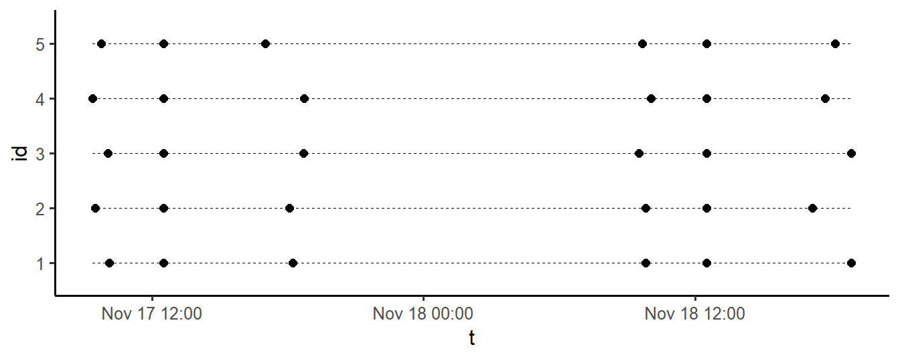
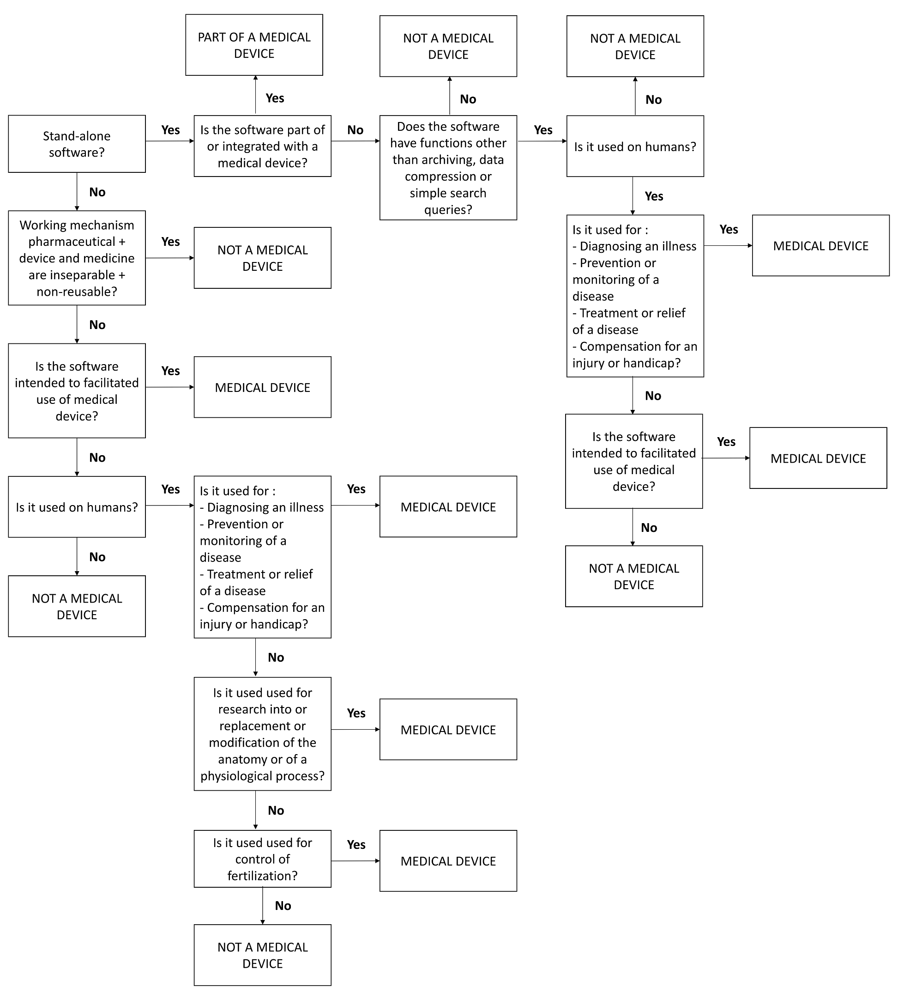

# (PART) EMA Methods {-}


# Study Design {#methods}
\index{Methods} 
\index{Methods!Study design}

As with all scientific research, EMA studies start with mindful consideration of
the study design. Issues that need to be considered are the research
question(s), the hypotheses, the population of interest, and the nature of the
comparison groups [@Shiffman2008].

Ample information on general study design issues can be found elsewhere (see for
example, the APH quality handbook, at <http://www.emgo.nl/kc/>). This chapter
highlights key design aspects of EMA studies.

## What is the EMA Research Question?

Given the plethora of new research options that emerged from the rapid
development in EMA technologies, it can be tempting to dive straight into
exploratory data collection, without giving much consideration to the
theoretical background of the study. That, however, would be one pitfall of EMA
research to avoid. Data mining is no substitute for theory. Asking participants
to contribute data without a rationale is unethical. As in all scientific
activities, defining the research question should be the first step.

Ask yourself what EMA could bring to your topic of interest. How is it different
from traditional assessment methods? What questions does it allow you to address
that you could not answer without it? For this, you could use any of the EMA
advantages discussed in Chapter \@ref(introduction). Are you interested in
real-life behavior, in differences between participants, in changes within
participants over time, or in potential causal pathways between health-related
variables? What relationships do you expect to find, and why? A solid
theoretical background, and clearly formulated explicit research questions and
hypotheses will help to make the right choices when you have to decide on the
other aspects of the study design.


## Who are the Study Participants?

Given the experimental nature of EMA, studies are often piloted in healthy or
sub-clinical populations. This is a recommended first step, to test the
experimental procedures and to avoid unnecessary burdening of vulnerable patient
populations. You should be aware, though, that results obtained in non-patient
populations do not necessarily generalize to patient populations. EMA mood
ratings, for example, might be much more variable in patients compared to
non-patients. Pilot studies should therefore also be conducted in the target
population. It is also advisable to write a manual on how to operate the EMA device and spend time on briefing participants on what is expected of them during the study. Depending on your study topic and EMA method, de-briefing might also be nescesarry, along with instructions on how to return a wearable or de-install an EMA app. 


## What are the Qualities of the EMA Measures?
\index{EMA!Passive EMA}
\index{EMA!Active EMA}
\index{Measurement error}

With the study hypotheses in place, theoretical constructs must be
operationalized into quantitative measures. For this, you should consult the
scientific literature on the reliability and validity of existing EMA measures [e.g., @Moore2016; @Rijsbergen2012].

In active EMA research, complex multi-dimensional constructs such as mood and
anxiety are often measured using single-item questions, to reduce the assessment
burden of participants, who are prompted several times per day. You should ask
yourself (and the scientific literature) what the psychometric properties are of
these measures. How do these EMA-measures compare to scores on traditional
assessments (e.g., self-report questionnaires, clinical interviews)? What is
known about the variability of items scores? And what is known about the
measurement errors? Surprisingly, these last questions are often ignored in EMA
research, even though it has been estimated that up to 30% to 50% of the
observed variance in intensive repeated measures data can be attributable to
measurement error [@Schuurman2015].

In passive EMA research, it is important to be aware of the characteristics and
limitations of the 'data acquisition interfaces' [@Stone2002]. For example, if
you want to collect accelerometer data, a variety of options exist. You can
collect these data via the built-in accelerometer of the smartphone of the
participants, via cheap commercially available activity trackers, such as
Fitbit, or via expensive wearable devices that are developed specifically for
scientific research. Each option comes with specific advantages and
disadvantages. Smartphone-based accelerometer data, for example, can be
collected with relative ease, but these data can also be noisy and incomplete,
since samples rates can often not be set and the precision of the built-in
sensors varies considerably from device to device. Commercial accelerometers may
have better precision and reliability [see, e.g., @Evenson2015], but
manufacturers often limit access to raw data and data pre-processing algorithms,
making it difficult (or even impossible) to fully analyze outcomes.'Scientific
wearables' do offer this access, but often choose function over form (design). 
They can therefore draw attention, prompting unwanted questions to partcipants. 
Being aware of these issues when you plan the study, will help
considerably in the analysis stage of your study. 


## What is the Sample Plan?
\index{Sampling}

An important next step is to define the EMA data sample plan. Questions that
need to be answered are:

  - How many days will data collection last?
  - On each day, how often are participants assessed?
  - How and when are participants invited for assessment?

The questions above should be answered as detailed as possible to best serve the
research question and the statistical power (see below). In practice, however,
it is often necessary to balance research interests, respondent burden,
and practical considerations, such as hardware limitations.

When determining the appropriate sample plan, start with mapping the expected
fluctuation or patterns, based on available knowledge. For example, when an
event is rare, it can be sufficient to ask participants to initiate EMA whenever
the event occurs, or prompt them with an end-of-day diary. Adding more prompts
in this scenario would not lead to more reliable data [@Piasecki2007].
Increasing the assessment frequency and study duration will allow for a more
detailed assessment of the outcome of interest. It is tempting to collect often
and for a long period of time. However, this may also increase respondent
burden, which may, in turn, affect study adherence and accuracy. Measurement
reactivity could also occur, where the EMA-induced enhanced focus on the outcome
of interest causes participants to increase or decrease on this outcome
[@Hufford2002; @VanBallegooijen2016].

Issues related to hardware should also be considered. Electronic wearables have
limited battery life and memory storage space. Memory space limitations of
actigraphy watches may require participants to visit the research site.
GPS-monitoring apps may have a negative impact on the battery life of the
smartphone of the participants. These practical issues may also result in data
loss and study drop-out.

Once all decisions related to the sampling plan are made, the procedure should
be thoroughly tested. As a first step, it can be insightful to simulate the
sample plan, as is done below, using the `sample_plan` function, which is part
of package `emaph`:


```r
# Simulating a signal-contingent sample plan.
library(emaph)
plan <- sample_plan(n_participants = 5,
                    n_days = 2,
                    times = c("09:00-11:00", "12:30", "17:00-19:00"),
                    plot = TRUE)
```

<div class="figure" style="text-align: center">

<p class="caption">(\#fig:fig3a)Generated two-day EMA sampling plan, for 5 participants</p>
</div>


##  What is the Optimal Sample Size?
\index{Methods!Power analysis}

The power of a statistical test is the probability that it will detect an effect
when this effect, in reality, exists. It is a function of the strength of the
effect size, sample size, the significance level (alpha), *and* the statistical
model. Determining the power of the experiment is an important step in the
design of any study - EMA studies included. Both under-powered and overpowered
studies are a waste of time and resources.

Conducting a power analysis can be easy or very difficult, depending on the
complexity of the experimental design and the adopted statistical technique. For
simple tests, such as the t-test and ANOVA, straightforward analytic solutions
exist, which are implemented in readily available tools. In R, one of those
tools is package `pwr` (which you can install, as you now know, via `install.packages('pwr')`).

For example, to use `pwr` to calculate the power of a t-test to detect a
moderate effect size (*d* = 0.5), with n = 30 per group, and a (two-sided)
significance level alpha of .05, type:


```r
# Power analysis of a t-test
# (analytical approach).

library(pwr)
pwr.t.test(d = 0.5, 
           n = 30,
           sig.level = 0.05,
           type = "two.sample",
           alternative = "two.sided")
#> 
#>      Two-sample t test power calculation 
#> 
#>               n = 30
#>               d = 0.5
#>       sig.level = 0.05
#>           power = 0.4778965
#>     alternative = two.sided
#> 
#> NOTE: n is number in *each* group
```

The power is 48% - not even close to the generally adopted standard of 80%. More
participants are needed to detect the hypothesized effect. Can you find the `n` for which power is 80%? 

EMA study designs are often characterized by repeated measures, complex
multi-level structures and the application of advanced statistical techniques.
You may find that available power calculators are too limited to properly take
key aspects of your design into account. If this happens, simulation techniques
may help. If power is the probability that a test will detect an effect it is
exists, it can be determined by noting the proportion of times a statistical
test reaches significance, if it is run, many times, on simulated data, in which
the hypothesized effect is present. To illustrate how this works, we will
calculate the power of the t-test again, through simulation:

\index{Simulating data} 


```r
# Power analysis of a t-test
# (simulation approach).

m1 = 0   # mean in group 1  
m2 = 0.5 # mean in group 2
sd = 1   # sd (in both groups)
n = 30   # sample size, per group

# conduct the experiment many times
nsim <- 10000
p <- numeric(nsim)
for (i in 1:nsim) {
  
  data <- data.frame(
    outcome <- c(
      rnorm(n, m1, sd), # group 1 data
      rnorm(n, m2, sd)  # group 2 data
    ),
    group <- c(
      rep(1, n), # group 1 indicator
      rep(2, n)) # group 2 indicator
  )
  
  # save significance of test
  p[i] <- t.test(outcome ~ group, data)$p.value
}

# power
sum(p < 0.05) / nsim
#> [1] 0.4788
```

As can be seen, the simulation results are very close to the output of
`pwr.t.test`. There was no immediate need to run this simulation. We already
knew that the power was 48%. The example illustrates, however, that simulation
is a valid option when power calculators are too limited. Simulating the right
data, of course, can be challenging as well, but you will find that R has
packages that simplify data simulation. For example, `mvrnorm` in package `MASS`
[@Venables2002] can be used to generate correlated data, and package
`simstudy` [@R-simstudy] can be used to generate complex longitudinal and
hierarchical data.


## What are the Ethical Aspects?
\index{Methods!Ethical considerations}

All clinical studies that involve human participants need to be evaluated by a
Medical Research and Ethics Committee (MREC; Dutch: 'METC'). Recently, the
committees have also been tasked to determine whether a medical device is used
and to evaluate the safety and quality of the device. Researchers are therefore
required to add a section in the research protocol, explaining why the
software/device is or is not a medical device. The official definition of a
medical device (Medical Device Act, or 'Wet Medische Hulpmiddelen') is as
follows:

> “Any instrument, apparatus or appliance, any software or material or any other
> article that is used alone or in combination, including any accessory and the 
> software required for its proper operation, that is intended by the manufacturer
> to be used specifically for diagnostic or therapeutic purposes, and is intended
> by the manufacturer to be used for human beings for the purpose of:
> - diagnosis, prevention, monitoring, treatment or alleviation of disease
> - diagnosis, monitoring, treatment, alleviation of or compensation for an injury or handicap
> - investigation, replacement or modification of the anatomy or of a physiological process
> - control of conception, and which does not achieve its principal intended action in or on the
> human body by pharmacological, immunological or metabolic means, but which may be 
> assisted in its function by such means.” [@ccmo_meddev]

In short, software can be classified as a medical device when it collects
patient-specific data and when it is specifically intended for one of the
above-mentioned objectives. In practice, the definition of medical devices
leaves a lot of room for confusion. Researchers often struggle with the question
whether their assessment tools should be considered a medical device or not. For
this purpose, flowcharts exist that help to determine whether an app or another
software product should be classified as a medical device [see, e.g.,
@Ekker2013, and http://cetool.nl/general/scanAid]. Figure \@ref(fig:fig3b) shows
such a flow-chart.

While planning your EMA study, you should also be mindful of the rules and
regulations that apply to data collection, storage and sharing. From May 2018
onward, the European Committee has enforced the General Data Protection
Regulation (GDPR; in Dutch: "Algemene Verordening Gegevensbescherming - AVG""; see
<https://gdpr-info.eu/>), which protects the data and privacy of EU citizens.
Complying to the GDPR can be a complex and time-consuming process, depending on
nature of your study. Do not hesitate to consult local experts or standard
guidelines provided by your organization (see, e.g.,
<http://www.emgo.nl/kc/checklist-avg/>).

In EMA studies, an important GDPR-related issue concerns the Data Processing
Agreement (DPA). When data processing is (partly) outsourced to a third party, a
Data Processing Agreement (DPA) should be drafted, that specifies the agreements
between the 'controller' and 'processor'. In this context, a controller is the
person or organization that determines the why and how of data collection (for
example you as a researcher). The processor processes the data on behalf of the
controller, for example by providing a data-collection service, or by storing
raw study data on a cloud-server.

Aspects of data processing that need to be addressed in this agreement include
the context, duration and termination of agreement, the nature of the data
collected, the duration of data storage, security measures taken to prevent
unauthorized access, and agreements on data ownership, data sharing, the
handling of personal data breaches, and liability. Most organizations offer
model agreements in which all relevant issues are addressed. Third parties may
offer model agreements as well. If so, however, these agreements need to be
checked for compliance to local regulations.

<div class="figure" style="text-align: center">

<p class="caption">(\#fig:fig3b)Flow-chart to determine whether study devices (including EMA apps) should be considered a medical device.</p>
</div>
